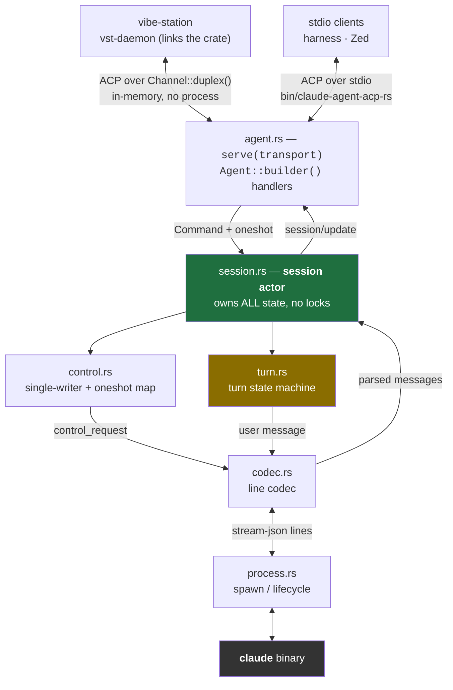
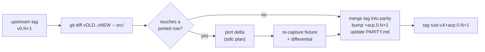

<!--
RULES — read before writing or implementing:
1. FORMAT: Bullets, tables, code, diagrams ONLY — no prose paragraphs
2. REQUIREMENTS: One crisp line each — no verbose descriptions
3. CHECKLIST: Mark items [x] as you complete them — this is your persistent todo list
4. READING TIME: Optimize for fast human scanning — if it's hard to skim, rewrite it
-->

# Native Rust driver for Claude ACP — replacing `@agentclientprotocol/claude-agent-acp`

Drive the `claude` binary directly from Rust. Zero Bun/Node/npm for Claude support.
A Rust **library** that serves ACP over any transport — linked into vibe-station as a cargo dependency on every platform, plus a thin stdio binary. Lives in a fork of the upstream adapter, at parity with a pinned upstream release tag.

---

## Goal & non-goals

| | |
|---|---|
| **Goal** | A Rust library that drives `claude` directly and serves ACP over any transport (D9) |
| **Goal** | Consumed by vibe-station as a cargo git dependency — compiled into `vst-daemon` for each target, no extra sidecar (D9) |
| **Goal** | Linux now; Windows + macOS **compile** from day one so they never rot (D12) |
| **Goal** | Parity with upstream tag `v0.70.0` — the version vibe-station runs today (D11) |
| **Goal** | Every phase gated by tests the orchestrator verifies cover named invariants — not just "green" |
| **Goal** | A differential harness vs the Node adapter, built **first**, not last |
| **Non-goal** | Porting `@anthropic-ai/claude-agent-sdk` — settled, see `EVALUATION.md` § Settled |
| **Non-goal** | Feature parity with the adapter's full surface — see `EVALUATION.md` § 2 (B) |
| **Non-goal** | Publishing to crates.io in this feature |
| **Non-goal** | vibe-station cutover — separate follow-up plan in the vibe-station repo (D9) |
| **Non-goal** | Runtime-testing on Windows/macOS — compile-checked here; a CI matrix is a follow-up (D12) |
| **Non-goal** | Catching up `v0.70.0 → v0.79.0` — the first sync cycle, after this plan (D11) |

---

## Change Map

```
rust/
  AGENTS.md             + Rust rules; overrides root (D10)
  scripts/rust-gate.sh  + fmt + clippy + test
  claude-agent-acp-rs/
    src/
      lib.rs            + crate root, forbid(unsafe)
      process.rs        + spawn, argv, lifecycle
      codec.rs          + stream-json line codec
      control.rs        + control_request channel
      session.rs        + session actor
      turn.rs           + turn state machine
      map.rs            + Claude msg -> SessionUpdate
      permission.rs     + can_use_tool -> ACP
      agent.rs          + serve(transport) API
      bin/claude-agent-acp-rs.rs  + drop-in binary
    examples/
      in_process.rs     + Channel wiring demo
    tests/
      harness/          + ACP client recorder
      differential.rs   + Node-vs-Rust frame diff
src/                    (upstream TS — never modified)
porting/
  EVALUATION.md       ~ moved from repo root
  SYNC.md             + upstream sync runbook
  capture.sh          + record Node adapter frames
  PARITY.md           + per-feature port status
skills/rust-coding/
  SKILL.md            ~ vendored, was git-ignored
```

| Today | After this plan |
|-------|-----------------|
| vibe-station spawns `bun <claude-agent-acp>/dist/index.js` | vibe-station links the crate; ACP runs in-memory, no process, no Node |
| Other ACP clients need Node | They spawn `claude-agent-acp-rs` over stdio |
| Desktop app would need a per-platform Node sidecar | Nothing extra to ship — compiled into `vst-daemon` per target |
| `CLAUDE_CODE_EXECUTABLE=claude` passed to the adapter | Driver resolves the binary itself |
| Rust port has no home with upstream history | Fork branch `parity` = upstream tag + `rust/` |
| No WS/stream-level differential test vs Node | Ordered-frame differential harness, phase 0 |
| `rust-coding` skill exists only in a git-ignored worktree | Vendored and committed |

---

## Research

> Evidence only. Every finding below is cited by a Key Decision or a phase item.
> `vst-*` paths are in the vibe-station repo (`~/code/fastestdevalive/vibe-station/rust/`), not the fork.

| # | Finding | Source |
|---|---------|--------|
| R1 | `query()` does no settings merge / retry / session state — bypass is safe | `EVALUATION.md` § Settled |
| R2 | `systemPrompt`, `agents`, `hooks`, `skills` travel in the `initialize` **control_request**, not CLI flags | `sdk.mjs:120:~4100` |
| R3 | Closing stdin after the prompt with a permission callback registered **deadlocks the CLI** | `sdk.mjs:118:20530` |
| R4 | Real argv omits `--print`: `--output-format stream-json --verbose --input-format stream-json` | `sdk.mjs:118:4903` |
| R5 | Control requests are **serialized over one channel** — a slow one head-of-line-blocks | `acp-agent.js:4416-4420` |
| R6 | `keep_alive` frames must be consumed silently | `sdk.mjs:118:23865` |
| R7 | Turn settlement is a reverse-engineered state machine w/ fixes for #453 #680 #825 #851 #866 #886 | `EVALUATION.md` § cost centre |
| R8 | `tokio::sync::mpsc::Receiver::recv` is **cancel-safe** — dissolves the JS async-generator hazard | `tokio-1.53.1/src/sync/mpsc/unbounded.rs:124` |
| R9 | vibe-station consumes only 8 of 14 `SessionUpdate` variants | `vst-agents/src/normalize.rs:340-473` |
| R10 | `AcpTransport` lives in vibe-station's `vst-agents` — a crate in the fork cannot implement it without a cross-repo dependency | `vst-agents/src/acp_transport.rs:115-178` |
| **R11** | **Prior port: the parity harness covered REST only. Every WS bug was found by live browser repro, not tests** | `vst-daemon/tests/parity_harness.rs`; commits `3612191` `7761826` `fc330cc` |
| **R12** | **Prior port: dispatch/ordering layer was rewritten 3× and has zero tests — private items in `server.rs`** | `vst-daemon/src/server.rs:933-997` |
| R13 | Prior port: `tokio::spawn`-per-message destroyed arrival ordering the keyed lock depended on | `server.rs:953-997`; commit `fc330cc` |
| R14 | Prior port: `broadcast` `Lagged` treated as termination silently killed forwarding forever | `vst-ws/src/handlers/session_open.rs:125-139` |
| R15 | Prior port: `.expect()` on a recoverable race aborted the **whole daemon** | `vst-store/src/transcript.rs:781`; commit `14b03f1` |
| R16 | Prior port: re-entrant lock via a held guard caused an indefinite hang; `rust-coding` §10 records §9's guess was wrong | `skills/rust-coding/SKILL.md` §9–10 |
| R17 | Semver build-metadata convention already in this workspace's lockfile: `1.1.6+spec-1.1.0` | `rust/Cargo.lock` |
| R18 | Upstream is at `v0.79.0`; vibe-station pins `v0.70.0` — 9 minor versions of drift | `gh api .../tags`; `vst-agents/examples/acp_hello.rs` |
| R19 | Upstream `AGENTS.md` / `CLAUDE.md` instruct `npm run check` + conventional-commit PR titles — TS-only rules | upstream `AGENTS.md` |
| R20 | Upstream ships `publish.yml` + release-please workflows | upstream `.github/workflows/` |
| R21 | `agent-client-protocol` 2.x agent side = `Agent::builder()` handler registration; JSON-RPC framing free | `EVALUATION.md` § 2 |
| R23 | `Channel::duplex()` is an in-memory ACP transport; `connect_with(transport: impl ConnectTo<Host>)` accepts it | `agent-client-protocol-2.1.0/src/jsonrpc.rs:6471-6487`, `:1871-1875` |
| R24 | Tauri ships sidecars **per target triple** (`vst-daemon-x86_64-unknown-linux-gnu`, …) via `externalBin` | `desktop/src-tauri/tauri.conf.json:42`; `desktop/src-tauri/binaries/` |
| R25 | SDK's Windows lifecycle differs: no SIGTERM (straight to 5 s kill), `windowsHide`, `.exe` suffix, reap via stdin close | `EVALUATION.md` § 1 rows 10–12 |
| R26 | vibe-station pins `agent-client-protocol = "=2.1.0"` exactly | `vst-agents/Cargo.toml:27` |
| R22 | TS source at `v0.70.0`: `src/acp-agent.ts` 406 KB — the port reads **src/**, not dist | `gh api .../contents/src?ref=v0.70.0` |

---

## Key Decisions

### D1 — Repo layout: fork upstream, Rust lives in `rust/` — ✅ accepted

- **What:** fork `github.com/agentclientprotocol/claude-agent-acp`; add a top-level `rust/` Cargo workspace; never modify their TS.
- **Why:** the porting workflow is `git diff <old-tag>..<new-tag> -- src/` → port the delta. That only works if both trees share a history.
- **Why not a separate repo:** you would have to vendor or submodule the TS anyway to diff it; a fork does that for free with zero merge conflict risk (you only *add* `rust/`).
- **Where:** fork `fastestdevalive/claude-agent-acp`, root `rust/`.
- **Branch model** — parity holds on exactly one branch:

| Branch | Tracks | Rule |
|--------|--------|------|
| `upstream/main` | upstream | never touched |
| fork `main` | mirror of upstream `main` | only `gh repo sync`; never commit |
| fork **`parity`** (default) | an upstream **release tag** + `rust/` | "Rust at parity with TS" holds at every HEAD |
| `feat/*` worktrees | branched off `parity` | merged back only when their phase gates pass |

- `parity` advances tag-by-tag (`v0.70.0` → `v0.71.0` …), never to upstream `main` — a tag is a fixed thing to be at parity *with*.

### D2 — Versioning: `x.y.z+acp.<upstream>`, NOT a mirrored version — ✅ accepted

- **What:** crate version is independent semver with upstream as **build metadata** — e.g. `0.1.0+acp.0.70.0`.
- **Why not mirroring:** you cannot ship a Rust-only bugfix without either lying about parity or bumping a number that claims an upstream change happened.
- **Why not a plain pin:** cargo resolution ignores build metadata, so it is free — but it is visible in `Cargo.toml`, `Cargo.lock` and `cargo tree`.
- **Precedent:** already in this workspace's own lockfile — `1.1.6+spec-1.1.0` (R17).
- **Tag format:** `rust-v0.1.0+acp.0.70.0`.

### D3 — "Parity" means parity of the **ported subset**, tracked in `PARITY.md` — ✅ accepted

- **What:** `porting/PARITY.md` — one row per upstream feature: `ported` / `skipped-deliberate` / `pending`.
- **Why:** `EVALUATION.md` § 2 (B) deliberately skips ~3.1k lines. Without an explicit ledger, every upstream release marks you "out of parity" forever and the signal becomes noise.
- **Gate:** a `pending` row is the only thing that blocks a parity claim. `skipped-deliberate` needs a one-line reason.

### D4 — Session state lives in ONE actor task. No `Arc<Mutex<Session>>`.

- **What:** one tokio task owns all session state; operations arrive as `Command` over `mpsc` with a bundled `oneshot` reply.
- **Why:** JS is single-threaded — every synchronous stretch between `await`s is atomic *by construction*, and upstream relies on that implicitly. A line-by-line port onto shared locks imports races upstream never had.
- **Precedent:** already the house pattern — `vst-agents/src/acp_connection.rs:1-25`.
- **Enforced by:** `rust-coding` §3 (keyed locks stay keyed, single-writer by module visibility), §4 (`.await` under a `std::sync::Mutex` guard is forbidden), §10 (re-entrant guard deadlock).

### D5 — Ordering: dispatch is a **public, testable unit** from day one

- **What:** the turn/message dispatch layer is a `pub` function + a runner taking an injectable handler — not a private closure.
- **Why:** R12 — the prior port's equivalent layer was rewritten three times and is still untested because it was private to `server.rs`.
- **Rule:** if it was rewritten more than once last time, it gets a unit test this time.

### D6 — Control channel is a single-writer actor with a `oneshot` correlation map

- **What:** one task owns the child's stdin; requests register a `oneshot` keyed by `request_id`.
- **Why:** R5 says the channel is serialized anyway — model it explicitly rather than discovering it.
- **Must handle:** `keep_alive` (R6), `control_cancel_request`, `suppressControlResponse` sentinel, `pending_permission_requests` replay.

### D7 — stdin stays open while any callback is registered

- **What:** track a `bidirectional_needs` flag; only close stdin when it is clear and the prompt is done.
- **Why:** R3 — otherwise the CLI deadlocks, and the symptom looks like a Claude hang.

### D8 — No `.expect()` on anything recoverable

- **Why:** R15 — one `.expect()` on an idempotent-migration race core-dumped the entire daemon.
- **Rule:** `rust-coding` §1. Panics are for broken invariants only.

### D9 — Library first: one ACP agent, any transport — ✅ revised

- **What:** the crate's primary API is `serve(transport: impl ConnectTo<Agent>)` — the ACP agent, built with `Agent::builder()` (R21), served over whatever transport the caller hands it.
- **Transports:**

| Consumer | Transport | How |
|----------|-----------|-----|
| vibe-station | `Channel::duplex()` — in-memory, no process (R23) | `vst-daemon` links the crate; `acp_connection.rs` passes a `Channel` end to its existing `connect_with` instead of `AcpAgent` |
| Differential harness, Zed, other ACP clients | stdio | `bin/claude-agent-acp-rs.rs` = `serve(Stdio::new())` |

- **Why a library, not only a binary:** Tauri ships each sidecar per target triple (R24). A separate binary would be a 4th sidecar to build per platform — the same packaging pain as the npm per-platform packages we're escaping. A library rides inside `vst-daemon`: `cargo build --target X` covers it.
- **Why ACP as the in-process boundary:** vibe-station's client logic stays untouched — only the transport changes. And the harness tests the **same handler code** both transports run.
- **No cross-repo cycle:** the fork depends only on `agent-client-protocol`; vibe-station depends on the fork. Nothing depends on `vst-agents`.
- **Dependency pin:** `agent-client-protocol = "2.1"` (caret) so cargo unifies with vibe-station's `=2.1.0` (R26) — one copy of the crate, identical types. A bump is a coordinated change in both repos.
- **vibe-station consumes:** `claude-agent-acp-rs = { git = "…/claude-agent-acp", tag = "rust-v0.1.0+acp.0.70.0" }`.
- **Supersedes:** `EVALUATION.md` § target diagram. **Follow-up (vibe-station repo):** the ~1-line transport swap in `acp_connection.rs` + removing the Node spawn in `claude.rs:414-424`.

### D10 — Rust work has its own `rust/AGENTS.md`; upstream CI stays off

- **What:** `rust/AGENTS.md` states: for anything under `rust/`, it overrides the root `AGENTS.md`/`CLAUDE.md`.
- **Why:** R19 — implementers read the root `AGENTS.md` first and would run `npm run check` and follow TS PR rules.
- **What:** disable upstream's three workflows individually (`ci.yml`, `conventional-prs.yml`, `publish.yml`) — **not** Actions wholesale.
- **Why:** R20 — `publish.yml` + release-please must never run from the fork, but Actions must stay available for our own Rust CI matrix (D12).

### D11 — Port base is `v0.70.0`, not upstream HEAD

- **What:** `parity` starts at tag `v0.70.0` (`d0aafb1`).
- **Why:** it is what vibe-station runs; every `EVALUATION.md` line citation is against it; the differential baseline must match production.
- **Then:** `v0.70.0 → v0.79.0` (R18) is the **first sync cycle** per `porting/SYNC.md` — which doubles as the first real test of the D1 workflow.
- **Citations:** `acp-agent.js:N` refs are the npm `dist/`. Implementers read `src/*.ts` at `v0.70.0` (R22); regenerate `dist/` with `npm ci && npm run build` when a dist line must be checked.

### D12 — Platforms: Linux now; Windows + macOS compile from day one

- **What:** all OS-specific code lives in `process.rs` only, behind `#[cfg(unix)]` / `#[cfg(windows)]`. Nothing else in the crate may use `cfg(target_os)`.

| Concern | Unix (linux, macOS) | Windows |
|---------|---------------------|---------|
| Kill ladder | SIGTERM → grace → SIGKILL, to the **process group** | no SIGTERM — close stdin, then hard kill after 5 s (R25) |
| Process tree | own process group (`setsid`), `killpg` | job object, kill-on-close |
| Console | n/a | `CREATE_NO_WINDOW` — else a console flashes (R25 `windowsHide`) |
| Binary name | `claude` | `claude.exe` |
| Reap on parent exit | kill the group | job object closes with the handle |

- **Guard G8:** `cargo check --target x86_64-pc-windows-gnu` and `--target aarch64-apple-darwin` pass every phase — `cfg` code can't rot unnoticed.
- **Runtime tests:** Linux only in this plan. Windows/macOS runtime tests = our own `rust-ci.yml` matrix on GitHub runners, a follow-up (why D10 keeps Actions on).
- **If a dependency's build script blocks cross-`check`:** flag it in `## Key Decisions`, don't silently drop the target.

---

## Architecture



- Green = the single owner of mutable state (D4).
- Amber = the cost centre (R7).
- One agent, two transports: in-memory for vibe-station, stdio for everything else (D9).
- Only `process.rs` knows which OS it runs on (D12).

---

## System boundaries

### B1 — ACP client ↔ `claude-agent-acp-rs` (JSON-RPC over `Channel` or stdio)

```rust
// the crate's public entry point — identical behaviour on every transport
pub async fn serve(transport: impl ConnectTo<Agent> + 'static, opts: ServeOptions)
    -> Result<(), Error>
```

| Direction | Method | Handled | Notes |
|-----------|--------|:-------:|-------|
| client → agent | `initialize` | ✅ | capabilities + `_meta.steering.supported: true` |
| client → agent | `session/new` | ✅ | returns `sessionId` = Claude's native resume id |
| client → agent | `session/load` | ✅ | resume via `--resume=<id>` |
| client → agent | `session/prompt` | ✅ | resolves with `stopReason` when the turn settles |
| client → agent | `session/cancel` (notification) | ✅ | → control `interrupt` |
| client → agent | `_session/steering` (ext) | ✅ | `"now"` priority injection; idle → `{outcome:"promptRequired"}` |
| client → agent | everything else (`authenticate`, `set_mode`, `_session/goal`, …) | ❌ | JSON-RPC `-32601` method-not-found; `skipped-deliberate` in `PARITY.md` |
| agent → client | `session/update` | ✅ | 8 variants only — see below |
| agent → client | `session/request_permission` | ✅ | from `can_use_tool` (phase 5) |

- **Emitted `SessionUpdate` variants (only these 8, R9):** `AgentMessageChunk`, `AgentThoughtChunk`, `UserMessageChunk`, `ToolCall`, `ToolCallUpdate`, `CurrentModeUpdate`, `AvailableCommandsUpdate`, `Plan`.
- **Not emitted:** `SessionInfoUpdate`, `ConfigOptionUpdate`, `UsageUpdate` — ignore-listed in the harness, `skipped-deliberate` in `PARITY.md`.
- **Source of truth:** the Node adapter at `v0.70.0` for every ✅ row — a divergence is a bug here.
- **On failure:** JSON-RPC error response; the process never panics (D8).

### B2 — `claude-agent-acp-rs` ↔ `claude` binary (subprocess)

```
argv:  claude --output-format stream-json --verbose --input-format stream-json   (R4, no --print)
env:   CLAUDE_CODE_ENTRYPOINT=<set>          ; NODE_OPTIONS deleted
stdin:  newline-delimited JSON
        {type:"user", session_id:"", message:{role,content:[...]}, parent_tool_use_id:null}
        {type:"control_request", request_id:<13-char>, request:{subtype, ...}}
        {type:"control_cancel_request", request_id}
stdout: newline-delimited JSON
        {type:"assistant"|"user"|"result"|"system"|"stream_event"|"control_request"|"control_response"|"keep_alive"}
```

| Error | Handling |
|---|---|
| spawn fails | `Err(SpawnFailed)` w/ stderr tail (2 KB) |
| non-JSON line | log + skip, **never fatal** |
| `result` with `is_error` | replaces raw process error in the reported error |
| exit before `result` | `Err(ExitedEarly)` after stderr drain |
| `keep_alive` | consumed silently (R6) |
| unknown control subtype | respond `{subtype:"error"}`, never hang |

---

## Phase Guard Protocol

> Applies to **every** phase. `/sdlc turn-implement` runs the `N.T*` block itself and never trusts
> the terminated implementer's self-report (`PHASES.md:47`).

### Implementer subagent (deepseek mode) must, per phase

1. Read `rust/AGENTS.md` (overrides the root `AGENTS.md` — D10), then load `skills/rust-coding/SKILL.md`, `coding-agent-guardrails`, `coding`.
2. Write the `N.T*` tests **before or alongside** the implementation — not after.
3. Run the full gate and paste real output:
   ```
   bash rust/scripts/rust-gate.sh          # fmt + clippy + test, per rust-coding §7
   timeout 180 cargo test -p claude-agent-acp-rs
   ```
4. Write any deviation into `## Key Decisions` before finishing — it will not exist for phase N+1.

### Orchestrator (sonnet) must, per phase — this is the real gate

| # | Check | Fail action |
|---|-------|-------------|
| G1 | Re-run the gate itself. Never trust the subagent's word (`rust-coding` §7). | respawn |
| G2 | **Every `INV-*` assigned to phase N has a named test that actually asserts it** — open the test, read the assertion. A test named for an invariant that asserts something weaker is a fail. | respawn w/ the specific INV cited |
| G3 | No test exceeds its timeout. A hang is a failure, same severity as a panic (`rust-coding` §9). | respawn |
| G4 | `grep -rn "unwrap()\|expect(" rust/claude-agent-acp-rs/src/` — every hit is on a type-system-guaranteed invariant or it fails (D8, R15). | respawn |
| G5 | `grep -rn "Arc<Mutex<.*Session" rust/` returns nothing (D4). | respawn |
| G7 | `git diff v0.70.0 -- src/ package.json` is empty — upstream TS untouched (D1). | respawn |
| G8 | `cargo check --target x86_64-pc-windows-gnu` and `--target aarch64-apple-darwin` pass (D12). | respawn |
| G9 | `grep -rn "cfg(unix)\|cfg(windows)\|cfg(target_os" rust/claude-agent-acp-rs/src/` hits only `process.rs` (D12). | respawn |
| G6 | Any item rewritten in a previous phase has a unit test now (D5, R12). | respawn |

- Retries: `implementer.turn.max_retries: 2`, then escalate per `PHASES.md:48`.
- Pass → auto-commit `chore(sdlc): claude-acp-rust/<NN> implement phase <N>/<total>`.

---

## Invariant Registry

> G2 checks these. An invariant with no test is an incomplete phase, regardless of green.

| ID | Invariant | Phase | Source |
|----|-----------|-------|--------|
| INV-1 | A non-JSON stdout line never terminates the stream | 1 | R6 |
| INV-2 | Partial lines reassemble across read boundaries; a 10 MB line parses | 1 | SDK uses `readline`, no cap |
| INV-3 | Multi-byte UTF-8 split across reads is never shredded | 1 | prior port L18 |
| INV-4 | On exit, stderr is fully drained before the error is reported | 1 | `sdk.mjs:118:704` |
| INV-5 | Kill ladder: SIGTERM then SIGKILL; user abort never hard-kills directly | 1 | `sdk.mjs:118:~14900` |
| INV-6 | No orphan `claude` process after `dispose()` | 1 | prior port L18 (98 orphans found live) |
| INV-7 | `keep_alive` is consumed and never surfaces to the caller | 2 | R6 |
| INV-8 | Exactly one writer to child stdin at any instant | 2 | D6 |
| INV-9 | A `control_response` resolves exactly one `oneshot`; unknown ids are dropped, not panicked | 2 | D6, D8 |
| INV-10 | `control_cancel_request` resolves the pending request as cancelled | 2 | `sdk.mjs:118:~24900` |
| INV-11 | The `initialize` request carries systemPrompt/agents/hooks/skills | 2 | R2 |
| INV-12 | stdin stays open while any callback is registered | 2 | R3, D7 |
| INV-13 | Message arrival order is preserved end to end under load | 3 | R13 |
| INV-14 | At most ONE active turn per session at every instant (high-water assert) | 3 | prior port L1 |
| INV-15 | A cancel while parked on an idle `recv` loses no message | 3 | R8 |
| INV-16 | A turn with live subagents does not settle until they drain | 3 | #866 |
| INV-17 | A wedged stream settles via the force-cancel floor, never hangs | 3 | #680 |
| INV-18 | Each of the 8 emitted variants maps 1:1; the 3 discarded are never emitted | 4 | R9 |
| INV-19 | A streamed partial tool input refines rather than duplicating the tool call | 4 | `acp-agent.js:179-232` |
| INV-20 | A permission request always references a tool call the client has already seen | 5 | #851 |
| INV-21 | A denied permission ends the turn cleanly, never hangs | 5 | — |
| INV-22 | Cancel is idempotent; repeated cancels do not extend the deadline | 6 | `acp-agent.js:3595-3605` |
| INV-23 | Orphaned queued turns are reconciled, not double-counted | 6 | `acp-agent.js:3608-3648` |
| INV-24 | Rust frame stream == Node frame stream for the scripted corpus, **in order** | 0, 8 | R11 |
| INV-25 | Windows and macOS targets compile | all | D12 |
| INV-26 | In-memory `Channel` and stdio transports produce the identical frame stream | 7 | D9 |

---

## Implementation Phases

### Phase 0 — Harness first, code second

> R11 is the reason this is phase 0 and not phase 8. The prior port shipped a REST-only harness and
> found every WS bug by hand in a browser.
> **Precondition:** the § Bootstrap steps are done — fork exists, `parity` branch is at `v0.70.0`.

- [ ] **0.1** `rust/` Cargo workspace; crate `claude-agent-acp-rs` version `0.1.0+acp.0.70.0` (D2); `rust/.gitignore` for `target/`
- [ ] **0.2** `rust/AGENTS.md` — overrides root `AGENTS.md`/`CLAUDE.md` for `rust/**`; points at `skills/rust-coding/SKILL.md` (D10)
- [ ] **0.3** `rust/scripts/rust-gate.sh` per `rust-coding` §7 — one canonical invocation
- [ ] **0.4** Harness ACP client (Rust, `Client::builder()`) that drives **any** ACP agent binary over stdio and records the **ordered** frame stream
- [ ] **0.5** `porting/capture.sh` — runs the harness client against the Node adapter (`npm ci && npm run build` at `v0.70.0`) → fixture
- [ ] **0.6** Corpus ≥8 scripts: text-only · single tool · multi-tool · permission-prompt · denied-permission · cancel-mid-turn · subagent/Task · error-result
- [ ] **0.7** `tests/differential.rs` — same client against the Rust binary, diff vs fixture; ignore-list for `skipped-deliberate` features (D3)
- [ ] **0.8** `porting/PARITY.md` seeded from `porting/EVALUATION.md` § 2 (A)/(B)
- [ ] **0.9** `porting/SYNC.md` — the upstream sync runbook (§ Sync workflow below, as a checklist)

**Verify phase 0:**
- [ ] **0.T1** Integration — `capture.sh`: produces a stable fixture across 2 consecutive runs (no nondeterministic ordering)
- [ ] **0.T2** Unit — `differential`: a deliberately reordered frame stream **fails** the diff (the harness detects ordering, not just set equality) — **INV-24**
- [ ] **0.T3** Unit — `differential`: an ignore-listed feature's absence passes
- [ ] **0.T4** Gate — `rust-gate.sh` clean on an empty crate
- [ ] **0.T5** Regression — `git diff v0.70.0 -- src/ package.json` is empty: no upstream TS touched (D1)

---

### Phase 1 — Process transport & line codec

- [ ] **1.1** `process.rs` — spawn w/ R4 argv; `CLAUDE_CODE_ENTRYPOINT`; delete `NODE_OPTIONS`
- [ ] **1.2** Binary resolution: explicit path → `CLAUDE_CODE_EXECUTABLE` → PATH. Typed error on miss
- [ ] **1.3** `codec.rs` — newline-delimited JSON, partial-line buffering, UTF-8 continuation carry
- [ ] **1.4** stderr: 2 KB rolling tail + drain-before-exit (200 ms cap)
- [ ] **1.5** Kill ladder w/ a **separate** forwarded abort token — unix: SIGTERM→SIGKILL to the process group; windows: stdin close → 5 s kill (D12)
- [ ] **1.6** Child registry + reap on parent exit — unix: process group; windows: job object (D12)
- [ ] **1.7** Windows spawn flags: `CREATE_NO_WINDOW`; `claude.exe` resolution (D12)

**Verify phase 1:**
- [ ] **1.T1** Unit — `codec`: garbage line is skipped, stream continues — **INV-1**
- [ ] **1.T2** Unit — `codec`: a 10 MB single line parses; a message split across 3 reads reassembles — **INV-2**
- [ ] **1.T3** Unit — `codec`: a 4-byte UTF-8 char split across reads decodes intact — **INV-3**
- [ ] **1.T4** Integration — `process`: fake child writing to stderr then exiting → full tail in the error — **INV-4**
- [ ] **1.T5** Integration — `process`: abort sends SIGTERM first, SIGKILL only after grace — **INV-5**
- [ ] **1.T6** Integration — `process`: after `dispose()`, `pgrep` finds no child — **INV-6**
- [ ] **1.T7** Regression — `timeout 60`: no test hangs (`rust-coding` §9)
- [ ] **1.T8** Gate — G8 cross-target `cargo check` passes for windows + macOS — **INV-25**
- [ ] **1.T9** Unit — `process`: binary-name resolution returns `claude.exe` under `cfg(windows)` logic (pure fn, tested on linux via an injected OS enum)

---

### Phase 2 — Control channel

- [ ] **2.1** `control.rs` — single-writer task owning stdin (D6)
- [ ] **2.2** `request_id` generation; `oneshot` correlation map; unknown-id drop
- [ ] **2.3** Inbound routing: `control_response` · `control_request` · `control_cancel_request` · `keep_alive`
- [ ] **2.4** `initialize` handshake carrying systemPrompt/agents/hooks/skills (R2); parse `commands`/`models`/`account`
- [ ] **2.5** `suppressControlResponse` sentinel — a handler may decline to answer
- [ ] **2.6** `pending_permission_requests` replay from the initialize response
- [ ] **2.7** `bidirectional_needs` flag gating stdin close (D7)

**Verify phase 2:**
- [ ] **2.T1** Unit — `control`: `keep_alive` is consumed, caller sees nothing — **INV-7**
- [ ] **2.T2** Unit — `control`: 100 concurrent requests → exactly 100 stdin writes, no interleaved bytes — **INV-8**
- [ ] **2.T3** Unit — `control`: response for an unknown `request_id` is dropped, no panic — **INV-9**
- [ ] **2.T4** Unit — `control`: `control_cancel_request` resolves the pending future as cancelled — **INV-10**
- [ ] **2.T5** Unit — `control`: the emitted `initialize` frame contains all of systemPrompt/agents/hooks/skills — **INV-11**
- [ ] **2.T6** Integration — `control`: with a callback registered, stdin is still open after the prompt is written — **INV-12**
- [ ] **2.T7** Regression — a slow control request does not block *inbound* stream parsing (R5 is about outbound only)

---

### Phase 3 — Session actor & turn state machine

> The cost centre (R7). Budget the most retries here.

- [ ] **3.1** `session.rs` — actor task, `Command` enum, `oneshot` replies (D4)
- [ ] **3.2** **`pub fn dispatch_lane`-equivalent: the turn dispatch decision is a public, injectable unit** (D5)
- [ ] **3.3** `turn.rs` — Turn struct, activate / settle / defer
- [ ] **3.4** Echo tracking; pre-echo abandonment is a **known hole**, documented not fixed (#825)
- [ ] **3.5** Subagent hold: a turn with live subagents routes every settle through `settle_or_defer` (#866)
- [ ] **3.6** Force-cancel floor for a wedged stream (#680)
- [ ] **3.7** Read loop: `select!` on cancel token vs `recv()` — cancel-safe, no held-future hack (R8)

**Verify phase 3:**
- [ ] **3.T1** Unit — `dispatch`: 1000 messages through the injectable handler arrive in send order — **INV-13**
- [ ] **3.T2** Unit — `session`: 25 interleaved open/close, high-water counter of live turns is exactly 1, 0 remaining — **INV-14**
- [ ] **3.T3** Unit — `turn`: cancel fired while parked on an idle `recv` — the pending message is still delivered — **INV-15**
- [ ] **3.T4** Unit — `turn`: a turn with 2 live subagents does not settle until both drain — **INV-16**
- [ ] **3.T5** Unit — `turn`: a stream that never yields settles via the force floor within the grace — **INV-17**
- [ ] **3.T6** Regression — `#[tokio::test(flavor = "multi_thread")]` on 3.T1–3.T5; no `Arc<Mutex<Session>>` (G5)
- [ ] **3.T7** Regression — `timeout 120`; no test hangs

---

### Phase 4 — Message mapping

- [ ] **4.1** `map.rs` — `assistant`/`user` consolidated → `AgentMessageChunk` / `AgentThoughtChunk` / `UserMessageChunk`
- [ ] **4.2** `stream_event` deltas → chunk updates
- [ ] **4.3** `tool_use` → `ToolCall`; `tool_result` → `ToolCallUpdate`
- [ ] **4.4** Streamed partial tool input: incremental JSON-prefix lexer, refine not duplicate
- [ ] **4.5** `TodoWrite` → `Plan`; `commands_changed` → `AvailableCommandsUpdate`; mode → `CurrentModeUpdate`
- [ ] **4.6** Explicitly drop `SessionInfoUpdate` / `ConfigOptionUpdate` / `UsageUpdate` (R9)

**Verify phase 4:**
- [ ] **4.T1** Unit — `map`: table-driven, one case per emitted variant; the 3 discarded produce `None` — **INV-18**
- [ ] **4.T2** Unit — `map`: a tool input streamed in 5 fragments yields 1 `ToolCall` + N `ToolCallUpdate`, never 2 `ToolCall` — **INV-19**
- [ ] **4.T3** Integration — `differential`: text-only + single-tool corpus scripts now pass — **INV-24**
- [ ] **4.T4** Regression — dedupe: a block present in both `stream_event` and the consolidated message emits once

---

### Phase 5 — Permission translation

- [ ] **5.1** `permission.rs` — `can_use_tool` → ACP `session/request_permission`
- [ ] **5.2** `ensure_tool_call_emitted` before any permission request (#851)
- [ ] **5.3** Outcome mapping incl. allow-always → `_meta.permission` rule additions
- [ ] **5.4** Deny path ends the turn cleanly

**Verify phase 5:**
- [ ] **5.T1** Unit — `permission`: a permission request for an unseen tool id first emits the `ToolCall` — **INV-20**
- [ ] **5.T2** Unit — `permission`: deny → turn settles with the right stop reason, no hang — **INV-21**
- [ ] **5.T3** Integration — `differential`: permission-prompt + denied-permission scripts pass — **INV-24**
- [ ] **5.T4** Regression — a permission request arriving for a subagent is attributed to its parent tool call

---

### Phase 6 — Cancel, interrupt, orphan reconciliation

- [ ] **6.1** `cancel_active_prompt` → control `interrupt`
- [ ] **6.2** Force-cancel deadline armed once per cancel, not per call
- [ ] **6.3** Orphan reconciliation; `interrupt_receipt_v1` `still_queued` lane + legacy count lane
- [ ] **6.4** Guard the **field**, not the receipt — a bare `{}` must not read as "all dropped"

**Verify phase 6:**
- [ ] **6.T1** Unit — `cancel`: 5 rapid cancels arm the deadline once — **INV-22**
- [ ] **6.T2** Unit — `cancel`: receipt with `still_queued` reconciles; a bare `{}` falls back to count-everything — **INV-23**
- [ ] **6.T3** Integration — `differential`: cancel-mid-turn script passes — **INV-24**
- [ ] **6.T4** Regression — cancel then a new prompt on the same session works

---

### Phase 7 — ACP agent binary (drop-in)

- [ ] **7.1** `agent.rs` — `pub async fn serve(transport, opts)`; `Agent::builder()` handlers for every ✅ row in B1; unhandled → `-32601`
- [ ] **7.2** `_session/steering` ext → control-channel injection with `"now"` priority
- [ ] **7.3** `bin/claude-agent-acp-rs.rs` — `serve(Stdio::new())`; stdout is ACP-only, all logs to stderr
- [ ] **7.5** `examples/in_process.rs` — `Channel::duplex()`: agent on one end, `Client::builder().connect_with(other_end, …)` on the other — the exact shape vibe-station will use
- [ ] **7.4** Shutdown on stdin EOF / SIGTERM: drain, then teardown, bounded deadline (prior port L11)

**Verify phase 7:**
- [ ] **7.T1** Integration — harness client runs `initialize → session/new → session/prompt → session/cancel` against the real binary + real `claude`, asserting shape not content
- [ ] **7.T2** Unit — `agent`: an unhandled method returns `-32601`, never hangs or panics
- [ ] **7.T3** Integration — stdin EOF mid-turn leaves no orphan `claude` and exits 0 — **INV-6**
- [ ] **7.T4** Regression — nothing but JSON-RPC frames ever reaches stdout (a stray `println!` fails the test)
- [ ] **7.T5** Integration — the text-only + single-tool corpus run over `Channel::duplex()` and over stdio yield identical ordered frames — **INV-26**

---

### Phase 8 — Final differential verification vs the Node implementation

> Dedicated phase, per the requirement that a subagent compare tests and codepaths against the real JS.

- [ ] **8.1** Run the **full** corpus through both paths; diff ordered frames — **INV-24**
- [ ] **8.2** **Codepath audit:** for each core range in `EVALUATION.md` § 2 (A), name the Rust file:line that covers it, or mark it `skipped-deliberate` in `PARITY.md` with a reason
- [ ] **8.3** **Invariant audit:** every `INV-*` maps to a passing named test; produce the table
- [ ] **8.4** **Reverse audit:** grep upstream `dist/acp-agent.js` for `issue #` / `NOTE` / `Deliberately` comments; for each, state ported / skipped / N-A
- [ ] **8.5** Update `PARITY.md`; tag `rust-v0.1.0+acp.0.70.0`

**Verify phase 8:**
- [ ] **8.T1** Integration — all ≥8 corpus scripts diff clean — **INV-24**
- [ ] **8.T2** Audit — no `EVALUATION.md` § 2 (A) range is unaccounted for
- [ ] **8.T3** Audit — no `INV-*` lacks a passing test
- [ ] **8.T4** Audit — every upstream `issue #` comment is classified
- [ ] **8.T5** Gate — `rust-gate.sh` clean; full suite under `timeout 300`

---

## Files & Phase Impact

> Paths relative to the fork root. `C` = `rust/claude-agent-acp-rs`.

| File | Status | Phase | Description / Contract |
|------|--------|-------|------------------------|
| `porting/EVALUATION.md` | Moved | bootstrap | From repo root; the feasibility evidence |
| `skills/rust-coding/SKILL.md` | Vendored | bootstrap | Was git-ignored in vibe-station |
| `.vibekit/config.yaml` | New | bootstrap | turn-implement, `meta_harness: vibe-station`, implementer `deepseek` |
| `rust/Cargo.toml` | New | 0 | Workspace; crate `0.1.0+acp.0.70.0` (D2) |
| `rust/.gitignore` | New | 0 | `target/` |
| `rust/AGENTS.md` | New | 0 | Overrides root `AGENTS.md` for `rust/**` (D10) |
| `rust/scripts/rust-gate.sh` | New | 0 | fmt + clippy + test, `rust-coding` §7 |
| `porting/capture.sh` | New | 0 | Records Node adapter ordered frames |
| `porting/PARITY.md` | New | 0, 8 | Per-feature port ledger (D3) |
| `porting/SYNC.md` | New | 0 | Upstream sync runbook |
| `C/tests/harness/` | New | 0 | ACP client that records ordered frames from any agent |
| `C/tests/differential.rs` | New | 0, 4–8 | Ordered-frame diff vs Node |
| `C/src/process.rs` | New | 1 | Spawn, argv, lifecycle, kill ladder — **the only file with `cfg(unix/windows)`** (D12) |
| `C/src/codec.rs` | New | 1 | stream-json line codec |
| `C/src/control.rs` | New | 2 | Control channel, single writer |
| `C/src/session.rs` | New | 3 | Session actor — sole state owner (D4) |
| `C/src/turn.rs` | New | 3, 6 | Turn state machine, settlement |
| `C/src/map.rs` | New | 4 | Claude msg → `SessionUpdate` |
| `C/src/permission.rs` | New | 5 | `can_use_tool` → ACP |
| `C/src/agent.rs` | New | 7 | `pub async fn serve(transport, opts)` — the crate's public API (D9) |
| `C/examples/in_process.rs` | New | 7 | `Channel::duplex()` wiring — vibe-station's shape |
| `C/src/bin/claude-agent-acp-rs.rs` | New | 7 | Drop-in stdio binary |
| `src/**`, `package.json` | Unchanged | — | Upstream TS; G7 enforces |

---

## Risks

| # | Risk | Mitigation | Owner phase |
|---|------|-----------|-------------|
| 1 | Turn settlement re-derived wrong; symptoms look like Claude bugs | Differential harness exists before any code (phase 0); INV-13..17 | 0, 3 |
| 2 | Upstream changes the wire format with no notice | `PARITY.md` + pinned tag; harness re-run every sync (§ Sync workflow) | 0, 8 |
| 3 | Implementer reaches for `Arc<Mutex<Session>>` to make it compile | G5 is a mechanical grep in every phase gate | all |
| 4 | Ordering layer untested again (R12 repeat) | D5 makes it public + injectable; G6 | 3 |
| 5 | A hang reported as "still working" | G3; `timeout` on every test invocation (`rust-coding` §9) | all |
| 6 | `.expect()` takes down the process (R15 repeat) | G4 grep; `rust-coding` §1 | all |
| 7 | Deepseek implementer silently skips tests | Orchestrator re-runs the gate (G1) and reads assertions (G2), never trusts self-report | all |
| 8 | Corpus too small to catch ordering bugs | ≥8 scripts incl. cancel + subagent + error paths (0.6) | 0 |
| 9 | Implementer follows upstream `AGENTS.md` (npm, TS PR rules) | `rust/AGENTS.md` override; stated first in every turn prompt (D10) | all |
| 10 | Fork runs upstream `publish.yml` / release-please | Actions disabled on the fork at bootstrap (D10) | bootstrap |
| 11 | Implementer "fixes" something in upstream `src/` | G7: `git diff v0.70.0 -- src/` must be empty | all |
| 12 | Two copies of `agent-client-protocol` in vibe-station's graph → type mismatch | Caret `"2.1"` in the fork unifies with vibe-station's `=2.1.0` (D9); check `cargo tree -d` in the follow-up | follow-up |
| 13 | Windows/macOS code rots while only Linux runs | G8 cross-`check` + G9 cfg confinement every phase (D12) | all |

---

## Bootstrap — before phase 0 (human-run, one time)

> Not an sdlc phase. Run by the human (or on explicit go-ahead) before `/sdlc` starts.

| # | Step | Command |
|---|------|---------|
| B-0 | Add cross-check targets (D12) | `rustup target add x86_64-pc-windows-gnu aarch64-apple-darwin` |
| B-1 | Fork on GitHub, no clone | `gh repo fork agentclientprotocol/claude-agent-acp --clone=false` |
| B-2 | Disable upstream's workflows, keep Actions on (D10) | `for w in ci.yml conventional-prs.yml publish.yml; do gh workflow disable $w -R fastestdevalive/claude-agent-acp; done` |
| B-3 | Point this repo at the fork | `git remote add origin git@github.com:fastestdevalive/claude-agent-acp.git && git remote add upstream https://github.com/agentclientprotocol/claude-agent-acp.git && git fetch --all --tags` |
| B-4 | Archive the eval history | `git branch eval-archive main` |
| B-5 | Build `parity` from the tag, replaying eval commits (drops the local `.gitignore`-only root commit) | `git checkout -b parity v0.70.0 && git cherry-pick <root>..eval-archive` |
| B-6 | Move evidence under `porting/` | `git mv EVALUATION.md porting/EVALUATION.md && git commit` |
| B-7 | Local `main` mirrors upstream | `git checkout -B main upstream/main` |
| B-8 | Publish, make `parity` default | `git push -u origin parity main && gh repo edit --default-branch parity` |
| B-9 | vst project default branch → `parity` | vst project settings |
| B-10 | Stage the worktree — **idle, no prompt** | `vst worktree create claude-acp-rust-eval --branch=feat/rust-port --base=parity --mode=<claude-sonet id> --no-parent` |

| B-11 | Verify subagent placement | a 1-line smoke spawn from the worktree's session appears **inside** that worktree in the vst UI — not as a new worktree (Q5) |

- Start phase 0 later with `/sdlc claude-acp-rust turn-implement` **inside** that worktree's session.

---

## Sync workflow — every upstream release (becomes `porting/SYNC.md` in 0.9)



- `parity` only ever merges **tags**, one at a time, never `upstream/main`.
- A tag whose diff touches no `ported` row still advances `parity` — the build metadata bump is the record.
- First run: `v0.70.0 → v0.79.0` (D11) — expect it to take several tags.

---

## Open questions

| # | Question | Blocks |
|---|----------|--------|
| ~~Q1~~ | ~~Fork vs Rust-in-vibe-station~~ — **resolved: fork (D1)** | — |
| Q2 | Fork under personal `fastestdevalive` (only authed account) or an org? | B-1 |
| Q3 | Does the corpus run against a real Anthropic account, or recorded fixtures only? Real = catches more, costs per run | 0.5 |
| ~~Q4~~ | ~~vibe-station cutover shape~~ — **resolved: in-process over `Channel::duplex()` (D9)** | — |
| Q5 | Does `meta_harness: vibe-station` spawn implementer turns as sessions **in** the current worktree? The sdlc skill doesn't document it — B-11 checks before phase 0 | B-11 |
