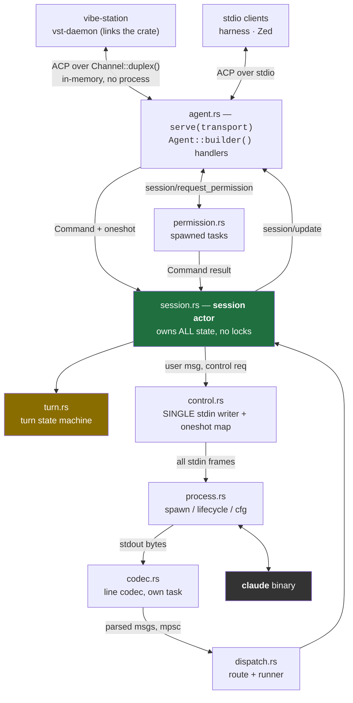
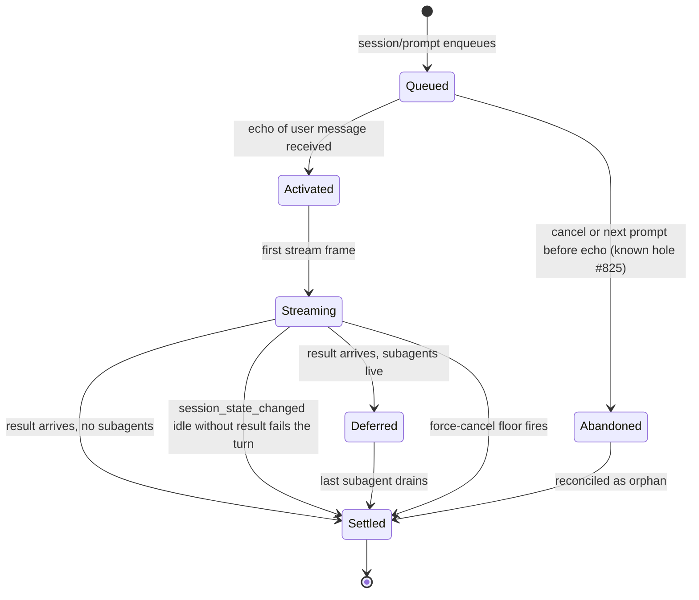
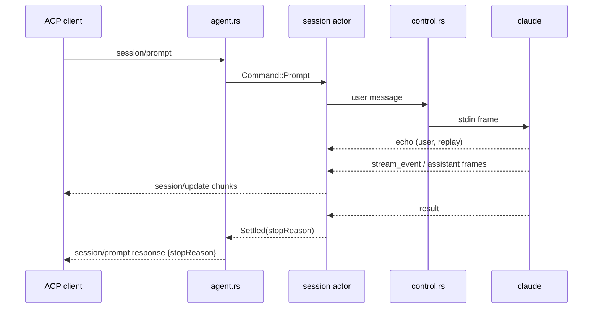
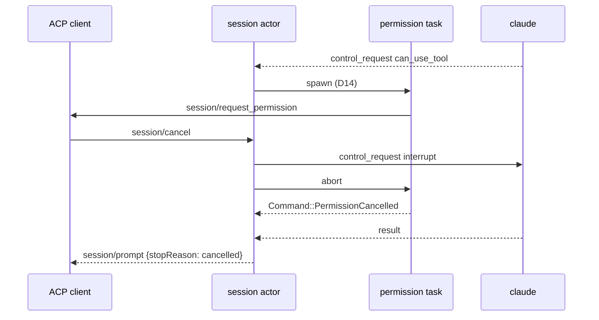
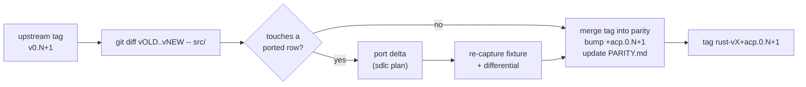

<!--
RULES — read before writing or implementing:
1. FORMAT: Bullets, tables, code, diagrams ONLY — no prose paragraphs
2. REQUIREMENTS: One crisp line each — no verbose descriptions
3. CHECKLIST: Mark items [x] as you complete them — this is your persistent todo list
4. READING TIME: Optimize for fast human scanning — if it's hard to skim, rewrite it
-->

# Native Rust driver for Claude ACP — replacing `@agentclientprotocol/claude-agent-acp`

Drive the `claude` binary directly from Rust. Zero Bun/Node/npm for Claude support.
A Rust **library** that serves ACP over any transport — linked into vibe-station as a cargo dependency on every platform, plus a thin stdio binary. Lives in a fork of the upstream adapter, at parity with a pinned upstream release tag.

> Path shorthand used below: `C` = `rust/claude-agent-acp-rs`. **Every `ADP <range>` and `acp-agent.js:N` line number is in the compiled `dist/acp-agent.js`**, not `src/acp-agent.ts` (9,040 lines, different numbering). `dist/` is git-ignored: run `npm ci && npm run build` at the repo root if `dist/` is absent (Decision D11).

---

## Goal & non-goals

| | |
|---|---|
| **Goal** | A Rust library that drives `claude` directly and serves ACP over any transport (D9) |
| **Goal** | Consumed by vibe-station as a cargo git dependency — compiled into `vst-daemon` for each target, no extra sidecar (D9) |
| **Goal** | Linux now; Windows + macOS **compile** from day one so they never rot (D12) |
| **Goal** | Parity with upstream tag `v0.70.0` — the version vibe-station runs today (D11) |
| **Goal** | Every phase gated by tests the orchestrator verifies cover named invariants — not just "green" |
| **Goal** | A deterministic differential harness vs the Node adapter, built **first**, not last (D13) |
| **Non-goal** | Porting `@anthropic-ai/claude-agent-sdk` — settled, see `EVALUATION.md` § Settled (R1) |
| **Non-goal** | Feature parity with the adapter's full surface — see `EVALUATION.md` § 2 (B) |
| **Non-goal** | Publishing to crates.io in this feature |
| **Non-goal** | vibe-station cutover — separate follow-up plan in the vibe-station repo (D9) |
| **Non-goal** | Runtime-testing on Windows/macOS — compile-checked here; a CI matrix is a follow-up (D12) |
| **Non-goal** | Catching up `v0.70.0 → v0.79.0` — the first sync cycle, after this plan (D11) |

## Requirements

| # | Requirement | Verified by |
|---|-------------|-------------|
| REQ-1 | `serve(transport, ServeOptions)` runs the same agent over `Channel::duplex()` and stdio | INV-26 |
| REQ-2 | For the scripted corpus, the ordered ACP frames equal the Node adapter's | INV-24 |
| REQ-3 | The crate never panics on bad input from `claude` or the client | INV-1, INV-9, G4 |
| REQ-4 | No `claude` process outlives its session or its host | INV-6, INV-28 |
| REQ-5 | A turn always settles — no hang under cancel, wedge, subagents or denial | INV-14..17, INV-21, INV-31 |
| REQ-6 | Windows + macOS targets compile at every phase | INV-25, G8 |
| REQ-7 | `porting/PARITY.md` lists every upstream feature as ported / skipped-deliberate / pending | phase 13 |

---

## Change Map

```
rust/
  AGENTS.md             + Rust rules; overrides root
  Cargo.toml            + workspace root
  Cargo.lock            + pinned deps
  clippy.toml           + banned types/methods
  scripts/rust-gate.sh  + fmt, clippy, test, cross-check
  scripts/selftest-gate.sh + gate mutation checks
  claude-agent-acp-rs/
    Cargo.toml          + crate manifest
    src/
      lib.rs            + crate root
      process.rs        + spawn, argv, lifecycle
      codec.rs          + stream-json line codec
      control.rs        + single stdin writer
      dispatch.rs       + injectable routing unit
      session.rs        + session actor
      turn.rs           + turn state machine
      map.rs            + Claude msg to SessionUpdate
      tools.rs          + tool kind/title/content
      permission.rs     + can_use_tool to ACP
      agent.rs          + serve(transport) API
      bin/claude-agent-acp-rs.rs  + drop-in binary
    examples/
      in_process.rs     + Channel wiring demo
    tests/
      differential.rs   + Node-vs-Rust frame diff
  acp-recorder/         + records ordered ACP frames
  fake-claude/          + replays recorded stream-json
src/                    (upstream TS — never modified)
porting/
  EVALUATION.md         ~ moved from repo root
  SYNC.md               + upstream sync runbook
  capture.sh            + Node adapter frames via fake-claude
  record-real.sh        + one-time real-claude recording
  PARITY.md             + per-feature port status
  corpus/               + scripted CLI transcripts
  fixtures/             + recorded Node frames
skills/rust-coding/
  SKILL.md              ~ vendored, was git-ignored
```

| Today | After this plan |
|-------|-----------------|
| vibe-station spawns `bun <claude-agent-acp>/dist/index.js` | vibe-station links the crate; ACP runs in-memory, no process, no Node |
| Other ACP clients need Node | They spawn `claude-agent-acp-rs` over stdio |
| Desktop app would need a per-platform Node sidecar | Nothing extra to ship — compiled into `vst-daemon` per target |
| `CLAUDE_CODE_EXECUTABLE=claude` passed to the adapter | Driver resolves the binary itself (Phase 3) |
| Rust port has no home with upstream history | Fork branch `parity` = upstream tag + `rust/` |
| No stream-level differential test vs Node | Ordered-frame differential over a fake `claude`, phases 0–2 |
| `rust-coding` skill exists only in a git-ignored worktree | Vendored and committed |

---

## Research

> Evidence only. Every finding below is cited by a Decision, invariant or phase item.
> `vst-*` paths are in the vibe-station repo (`~/code/fastestdevalive/vibe-station/rust/`), not the fork.
> `sdk.mjs:L:C` = line L, char offset C, in `@anthropic-ai/claude-agent-sdk@0.3.232` (1.3 MB, ~155 very wide lines).

| # | Finding | Source |
|---|---------|--------|
| R1 | `query()` does no settings merge / retry / session state — bypassing the SDK is safe | `EVALUATION.md` § Settled |
| R2 | `systemPrompt`, `agents`, `hooks`, `skills` travel in the `initialize` **control_request**, not CLI flags | `sdk.mjs:120:~4100` |
| R3 | The SDK closes stdin only after the first `result` when its input stream has ended; a registered permission callback keeps it open (`hasBidirectionalNeeds`) | `sdk.mjs:123:95`, `sdk.mjs:118:20884` |
| R4 | SDK argv prefix omits `--print`: `--output-format stream-json --verbose --input-format stream-json`; the adapter adds more flags (B2) | `sdk.mjs:118:5883`; `acp-agent.js:4868-4911` |
| R5 | Control requests are **serialized over one channel** — a slow one head-of-line-blocks | `acp-agent.js:4416-4420` |
| R6 | `keep_alive` frames must be consumed silently | `sdk.mjs:118:23865` |
| R7 | Turn settlement is a reverse-engineered state machine w/ fixes for #453 #680 #825 #851 #866 #886 | `EVALUATION.md` § cost centre |
| R8 | `tokio::sync::mpsc::UnboundedReceiver::recv` is **cancel-safe** — dissolves the JS async-generator hazard | `tokio-1.53.1/src/sync/mpsc/unbounded.rs:124` |
| R9 | vibe-station consumes only 8 of 14 `SessionUpdate` variants | `vst-agents/src/normalize.rs:340-473` |
| R10 | `AcpTransport` lives in `vst-agents` — a fork crate cannot implement it without a cross-repo cycle | `vst-agents/src/acp_transport.rs:115-178` |
| R11 | Prior port: the parity harness covered REST only; every WS bug was found by live browser repro | `vst-daemon/tests/parity_harness.rs`; commits `3612191` `7761826` `fc330cc` |
| R12 | Prior port: dispatch/ordering layer rewritten 3× with zero tests — private items | `vst-daemon/src/server.rs:933-997` |
| R13 | Prior port: `tokio::spawn`-per-message destroyed arrival ordering | `server.rs:953-997`; commit `fc330cc` |
| R14 | Prior port: `broadcast` `Lagged` treated as termination silently killed forwarding | `vst-ws/src/handlers/session_open.rs:125-139` |
| R15 | Prior port: `.expect()` on a recoverable race aborted the whole daemon | commit `14b03f1` |
| R16 | Prior port: re-entrant lock via a held guard hung indefinitely | `skills/rust-coding/SKILL.md` §9–10 |
| R17 | Semver build-metadata precedent in this workspace's lockfile: `1.1.6+spec-1.1.0` | `rust/Cargo.lock` |
| R18 | Upstream is at `v0.79.0`; vibe-station pins `v0.70.0` | `gh api .../tags`; `vst-agents/examples/acp_hello.rs` |
| R19 | Upstream `AGENTS.md` / `CLAUDE.md` instruct `npm run check` + conventional-commit PR titles | upstream `AGENTS.md` |
| R20 | Upstream ships `publish.yml` + release-please workflows | upstream `.github/workflows/` |
| R21 | `agent-client-protocol` 2.x agent side = `Agent::builder()` handler registration; JSON-RPC framing free | `EVALUATION.md` § 2 |
| R22 | TS source at `v0.70.0`: `src/acp-agent.ts` 406 KB — the port reads **src/**, not dist | `gh api .../contents/src?ref=v0.70.0` |
| R23 | `Channel::duplex()` is an in-memory ACP transport; `connect_with(impl ConnectTo<Host>)` accepts it | `agent-client-protocol-2.1.0/src/jsonrpc.rs:6471-6487`, `:1871-1875`, `:6552` |
| R24 | Tauri ships sidecars per target triple via `externalBin` | `desktop/src-tauri/tauri.conf.json:42` |
| R25 | SDK close ladder: end stdin → 2 s → SIGTERM → 5 s → SIGKILL; Windows: 2 s then 5 s hard kill; signals the child only; `windowsHide`; `.exe` | `sdk.mjs:118:12655`, `:13755`; `EVALUATION.md` § 1 rows 10–12 |
| R26 | vibe-station pins `agent-client-protocol = "=2.1.0"`; 2.2.0 is already published | `vst-agents/Cargo.toml:27`; `EVALUATION.md:199` |
| R27 | Adapter env sets `CLAUDE_CODE_EMIT_SESSION_STATE_EVENTS=1` — the idle-settle lane needs `session_state_changed` events | `acp-agent.js:4858` |
| R28 | Adapter `canUseTool` deny returns `{behavior:"deny", message:"User refused permission to run tool"}` **without** `interrupt` — the model continues | `acp-agent.js:4190-4193`, `:4263-4267` |
| R29 | Force-cancel grace default is 30 s, mutable for tests; armed inside `cancel()` | `acp-agent.js:49`, `:586`, `:3593-3605` |
| R30 | The adapter honours `CLAUDE_CODE_EXECUTABLE`, so a fake `claude` can stand in for both Node and Rust | `acp-agent.js:233-236`, `:4908` |
| R31 | `loadSession` replays history via SDK `getSessionMessages` (reads `~/.claude` JSONL); vibe-station calls `load_session` | `acp-agent.js:788-792`, `:3861-3863`; `vst-agents/src/acp_connection.rs:275`, `:688` |
| R32 | Steering: `_meta.steering.idleBehavior` other than `"promptRequired"` → `invalidParams`; idle + `promptRequired` → `{outcome:"promptRequired", reason:"noRunningTurn"}` | `acp-agent.js:80-88`, `:1147` |
| R33 | tokio offers safe `process_group(0)`, `creation_flags`, `kill_on_drop` — no `unsafe` needed for spawn flags | `tokio-1.53.1/src/process/mod.rs:664`, `:675`, `:790` |

---

## Key Decisions

### Decision D1: Repo layout — fork upstream, Rust lives in `rust/`

- **Decision:** fork `github.com/agentclientprotocol/claude-agent-acp` to `fastestdevalive/claude-agent-acp`; add a top-level `rust/` Cargo workspace; never modify upstream TS.
- **Rationale:** porting = `git diff <old-tag>..<new-tag> -- src/` → port the delta; needs shared history. A fork adds only `rust/`, so zero merge-conflict risk.
- **Where:** `rust/`, `porting/` (fork root).

| Branch | Tracks | Rule |
|--------|--------|------|
| `upstream/main` | upstream | never touched |
| fork `main` | mirror of upstream `main` | only `gh repo sync`; never commit |
| fork **`parity`** (default) | an upstream **release tag** + `rust/` | "Rust at parity with TS" holds at every HEAD |
| `feat/*` worktrees | branched off `parity` | merged back only when their phase gates pass |

- `parity` advances tag-by-tag (`v0.70.0` → `v0.71.0` …), never to upstream `main`.
- Sole upstream-file exception: root `.gitignore` gains `.claude/` and `.vibe-station/`; G7 excludes it.

### Decision D2: Versioning — `x.y.z+acp.<upstream>`, not a mirrored version

- **Decision:** crate version is independent semver with upstream as build metadata, e.g. `0.1.0+acp.0.70.0`; git tag `rust-v0.1.0+acp.0.70.0`.
- **Rationale:** a Rust-only bugfix must not claim an upstream change; cargo ignores build metadata (R17 precedent).
- **Where:** `rust/claude-agent-acp-rs/Cargo.toml`.

### Decision D3: "Parity" = parity of the ported subset, tracked in `PARITY.md`

- **Decision:** `porting/PARITY.md` — one row per upstream feature: `ported` / `skipped-deliberate` (needs a one-line reason) / `pending`.
- **Rationale:** `EVALUATION.md` § 2 (B) skips ~3.1k lines on purpose; without a ledger every release reads "out of parity".
- **Where:** `porting/PARITY.md`. A `pending` row is the only thing that blocks a parity claim.

### Decision D4: Session state lives in ONE actor task — no `Arc<Mutex<Session>>`

- **Decision:** one tokio task owns all session state; operations arrive as `Command` over `mpsc` with a bundled `oneshot` reply; nothing else holds a lock on session state.
- **Rationale:** JS run-to-completion atomicity is implicit upstream; a line-by-line port onto shared locks imports races upstream never had (R16 shows the lock failure mode). House pattern: `vst-agents/src/acp_connection.rs:1-25`.
- **Where:** `C/src/session.rs`. Enforced by `rust-coding` §3, §4, §10 and guard G5.

> **Phase-5 deviations (implementer, D4):** (1) The actor's read loop (5.3) is one `tokio::select!` (`biased`) multiplexing the `Command` channel, the codec stream, an injected turn-completion lane and the cancel token; on cancel it drains any remaining queued stream messages via `try_recv()` before exiting (INV-15). `run_dispatch` is kept as the reusable stream-only sequential pump in `dispatch.rs` (used by 5.T1); the actor reuses the shared `dispatch::route()` classification rather than `run_dispatch` itself, because it must multiplex four inputs. (2) Phase-5 turn completion is an **injected** `mpsc::UnboundedReceiver<()>` completion lane (`Session::spawn` param) — phase 6 replaces it with `result`-frame handling; a prompt's `oneshot` reply resolves on that lane. (3) Outbound user frames go to an `Option<Control>` (D6); `None` in actor-only unit tests. (4) The one-active-turn high-water counter is an `Arc<AtomicUsize>` (fetch_max) exposed via `Session::high_water()` — an atomic, not a Mutex/RwLock, so G5 stays clean. (5) `Command::Cancel` is a placeholder variant (real behaviour is phase 11).

> **Phase-6 deviation (implementer, D4):** `turn.rs` is delivered as a **self-contained, actor-driven state machine** (`Turn`, `TurnMachine`, `StopReason`, `TurnEvent`) with its own unit tests — the phase-6 file impact lists only `C/src/turn.rs`, and the session actor (`session.rs`) is **not** in that phase's file set. The actor's phase-5 injected `completions` lane therefore remains in place; the phase-6 items 6.1–6.6 (activate/settle/defer, echo, settle-or-defer with the live-subagent set, idle lane, stop-reason table + #453 fallback, orphan accounting) are all implemented and unit-tested on the machine directly. The actor rewiring to drive `TurnMachine` from `result`/`idle`/`task_*` frames happens when `session.rs` enters the file impact (a later phase). The pre-echo abandonment hole (`acp-agent.js:2141-2153`) is documented in `turn.rs` module docs, not fixed, per 6.2.

> **Phase-6 REWORK (implementer, D4, review 04):** an independent Opus review (`review-04-turn.md`) found the phase-6 machine did not reproduce upstream; findings #1–#15 are fixed per that spec. `turn.rs` now ports: the held-idle drain emitting `Settled` (#1); `ensure_active_turn` with the `ADP:1453` orphan-before-head order (#2); `owed_trailing_idles` (#3); the autonomous-origin lane (#4); `active = None` on settle/fail (#5); the `ADP:2771-2848` subtype table (max_tokens before is_error for success/error_during_execution, /login on success regardless of is_error, errors joined with `", "`) (#6); `Failed{kind, message}` with `FailureKind` + verbatim `TURN_NO_RESULT_MESSAGE`/`SESSION_ENDED_MESSAGE` (#7); `on_task_ended` removing only the live entry (#8); real `cancel()` (queued sweep + orphan credits + held inline-settle) with `abandon_active` kept as `force_cancel()` (#9); `on_stream_end()`/`fail_all(kind)` (#10); `prompt_uuid` on `Settled`/`Failed`/`Activated` (#11); echo hand-off cancelled-before-held (#12); the #453 fallback confined to the success arm (#13); and the per-turn `usage` accumulator reset at activation and reported on `Settled` (#14). The phase-8 wiring instructions (uuid stamping, uuid→oneshot map, `dispatch_stream` frame routing, `FinalText` before `Settled`, cancel→`machine.cancel()`, EOF→`on_stream_end()`/`fail_all`) are captured as items 8.7–8.9 and tests 8.T7–8.T11 above. **Known omissions (deferred, documented in `turn.rs` module docs, review 04 #14):** the steering lane (`steeredEchoes`/`steeredSettle`), the `msg_lifecycle_v1` per-uuid orphan map, and the two-phase `endedPerLevel` sweep — all recorded as `pending` for their own phases.

> **Phase-6c (implementer, D4, review 05):** `ensure_active_turn` regains upstream's early return — a user-turn result for a normal (non-held) active turn returns immediately, never consuming an orphan credit or promoting the queue head (`ADP:1408-1412`), fixing the echoed-then-queued misattribution/hang and the INV-30 orphan reuse; a held turn still settles with its deferred outcome and promotes the head. `on_session_state(state)` records `last_session_state` for EVERY state (`ADP:2050`) and `on_idle` only runs for `"idle"`, wired so every `session_state_changed` frame reaches it — the held-cancel trailer-debt rule (`ADP:3571`) now sees a real `"running"` and owes the interrupt's trailer. Minors: a held turn's cancel reports `deferredSettle.usage` (the usage its result recorded), and `on_idle` no longer clears `cancelled` (it stays set until `activateTurn`), so an orphan's late result after a cancelled idle emits no stray `FinalText`.

### Decision D5: Dispatch is a public, injectable unit from day one

- **Decision:** `pub fn route(msg: &StreamMsg, view: &TurnView) -> Route` plus a runner `pub async fn run_dispatch(rx, handler: impl Handler)` in its own file.
- **Rationale:** R12 — the prior port's untested ordering layer was rewritten three times because it was private.
- **Where:** `C/src/dispatch.rs`; ordering test INV-13.

> **Phase-5 deviation (implementer, D5):** `run_dispatch(rx, handler)` matches the plan signature exactly — a stream-only sequential pump with no `tokio::spawn` (R13); the cancel token lives in the session actor's own `select!` loop (5.3), not in `run_dispatch`. `route(&StreamMsg, &TurnView) -> Route` classifies purely by frame `type` in phase 5; `TurnView` is accepted (`_view`) as the phase-6 seam. The `Handler` trait is the injected sink (a recording handler in 5.T1).

### Decision D6: One writer owns child stdin — user messages and control traffic alike

- **Decision:** `control.rs` owns stdin; **every** stdin frame (user message, control_request, control_response, control_cancel_request) goes through it; outbound requests register a `oneshot` keyed by `request_id`.
- **Rationale:** R5 says the channel is serialized anyway; model it explicitly, and make INV-8 cover all frame kinds.
- **Where:** `C/src/control.rs`.
- **Inbound handling:** `keep_alive` (R6) dropped; inbound `control_request` handled in a spawned task (D14); inbound `control_cancel_request` aborts that task's handler (INV-10).
- **`suppressControlResponse`:** an SDK-internal JS symbol (`sdk.mjs:118:19850`); the port has no handler that declines to answer, so it is `skipped-deliberate` in `PARITY.md`.

> **Phase-4 deviations (implementer, D6):** (1) `Control::spawn` takes the child stdin as an `impl AsyncWrite` plus a **control-traffic-only** inbound `mpsc::UnboundedReceiver<Value>` — control.rs does not consume the codec's full frame stream; the phase-5 dispatch routes only `keep_alive`/`control_response`/`control_request`/`control_cancel_request` frames here and session frames to the session actor. (2) The inbound `control_request` handler is injected as `ControlOptions.on_request: Option<Arc<RequestHandler>>` where `RequestHandler = Box<dyn Fn(Value) -> BoxFuture<Value> + Send + Sync>` (a boxed future, no `futures` crate); the default (`None`) answers `{subtype:"error"}`. (3) The `initialize` request is built from `InitializeOptions` via `build_request()`, which always emits `forwardSubagentText` (the fixture carries `false`); optional `systemPrompt`/`agents`/`skills`/`toolAliases`/`hooks` are emitted only when set (matching the adapter dropping `undefined`). (4) `request_id` is a 13-char base36 string seeded from `SystemTime` nanos XOR a per-process `AtomicU64` counter (no `rand` dep). (5) The `pending_permission_requests` replay (4.5) routes each entry through the same spawned-task inbound handler via a new `Outbound::Replay` command (mirroring the SDK's `processPendingPermissionRequests`). (6) 4.T7/4.T8/4.T9 are not invariant-tied (INV-7..12 map to 4.T1..4.T6), so they use descriptive test names (`slow_outbound_does_not_block_inbound`, `pending_permission_replayed`, `unknown_subtype_errors`) rather than `inv_NN_` slugs. (7) Supporting change: `Process::take_stdin()` added in `process.rs` so the session actor can hand child stdin to `Control::spawn` (D6); the kill-ladder's `close_stdin`/`dispose` paths are unaffected (stdin is already `None` once taken).

### Decision D7: stdin stays open for the whole session

- **Decision:** stdin is closed only by `dispose()` / teardown (D12 ladder), never after a turn.
- **Rationale:** the adapter feeds a persistent input stream, so every later prompt is written to the same stdin; the SDK closes it only when that stream ends (R3); closing early deadlocks the CLI or breaks the next prompt.
- **Where:** `C/src/control.rs`, `C/src/process.rs`; INV-12.

### Decision D8: No `.expect()` / `.unwrap()` on anything recoverable

- **Decision:** panics only for broken invariants; clippy `unwrap_used` / `expect_used` are denied in `src/` (tests allowed).
- **Rationale:** R15 — one `.expect()` core-dumped a whole daemon; a grep (old G4) is judgment-based, a lint is mechanical.
- **Where:** `C/src/lib.rs` (`#![deny(clippy::unwrap_used, clippy::expect_used)]`, `#![cfg_attr(test, allow(...))]`), `rust/clippy.toml`.

### Decision D9: Library first — one ACP agent, any transport

- **Decision:** primary API is `pub async fn serve(transport: impl ConnectTo<Agent> + 'static, opts: ServeOptions) -> Result<(), Error>`, built with `Agent::builder()` (R21).
- **Rationale:** Tauri ships sidecars per target triple (R24), so a separate binary is a 4th sidecar per platform; a library rides inside `vst-daemon`. ACP as the in-process boundary keeps vibe-station's client logic untouched, and the harness tests the same handlers on both transports. The fork depends only on `agent-client-protocol` (R10 — no cycle).
- **Where:** `C/src/agent.rs`, `C/src/bin/claude-agent-acp-rs.rs`, `C/examples/in_process.rs`.

| Consumer | Transport | How |
|----------|-----------|-----|
| vibe-station | `Channel::duplex()` — in-memory (R23) | `vst-daemon` links the crate; passes one `Channel` end to its existing `connect_with` |
| Differential harness, Zed, other clients | stdio | `bin/claude-agent-acp-rs.rs` = `serve(Stdio::new(), ServeOptions::from_env())` |

- **Dependency pin:** manifest uses `agent-client-protocol = "2.1"` (unifies with vibe-station's `=2.1.0`, R26; verified in a scratch workspace: one copy, no duplicate in `cargo tree -d`).
- **Lock pin:** `rust/Cargo.lock` is committed with `agent-client-protocol` and `agent-client-protocol-schema` held at the versions vibe-station ships (2.1.0 / 1.7.0); gate check G10 fails if the lock drifts.
- **vibe-station consumes:** `claude-agent-acp-rs = { git = "…/claude-agent-acp", tag = "rust-v0.1.0+acp.0.70.0" }`.
- **Follow-up touch points (vibe-station repo, not this plan):** build the `Channel` transport in `acp_connection.rs`; pass `ServeOptions` (binary path, env, cwd) in place of the `AcpAgentConfig` spawn spec (`acp_connection.rs:19-20`, `:384-385`); let the crate own child teardown; remove the Node spawn in `claude.rs:414-424`.
- **Where:** supersedes the `EVALUATION.md` target diagram.

> **Phase-8 implementer deviations (D9):** (1) 8.T5 is delivered as a **full `Channel::duplex()` integration test** (`inv_session_new_model_permission_and_uuid`): it drives `session/new` over the channel against fake-claude and asserts `--model` / `--permission-mode` / `--session-id=<uuid>` all appear in the recorded argv and that the returned `sessionId` equals that uuid — stronger than the "unit-test `session_spawn_options` only" fallback the retry brief allowed; no `Meta` construction was needed (the requests are sent untyped). (2) The agent-level tests (8.T2/T5/T6/T4) send requests as `UntypedMessage`s and read the raw JSON-RPC `result`/error values rather than typed schema structs, sidestepping the generated `schema::v1` response-field surface; 8.T6 asserts the real SDK form `--resume=<id>` (with `=`) per the phase-2 finding. (3) 8.T4 is a raw-`std::process` regression that feeds an `initialize` request to the real binary over stdio and asserts every non-empty stdout line parses as a JSON-RPC frame (the recorder silently drops non-JSON lines, so the differential alone cannot catch a stray `println!`).

### Decision D10: Rust work has its own `rust/AGENTS.md`; upstream CI stays off

- **Decision:** `rust/AGENTS.md` overrides root `AGENTS.md`/`CLAUDE.md` for `rust/**`, and holds the implementer protocol (read it first, load skills, write `N.T*` tests first, run the gate, record deviations in Key Decisions).
- **Rationale:** R19 — implementers read root `AGENTS.md` first and would run `npm run check`; the scoped turn prompt does not carry the protocol (`PHASES.md:44`), so it must live in a file every phase reads.
- **Also:** `rust/AGENTS.md` maps `rust-coding` for this repo — §1–5, 7, 9, 10 apply; §6 wire truth = the Node adapter's ACP frames at `v0.70.0` (not `daemon/src/types.ts`); §8 (rusqlite) not applicable.
- **CI:** disable upstream's `ci.yml`, `conventional-prs.yml`, `publish.yml` individually — never Actions wholesale (R20); defence in depth: `publish.yml` triggers only on push to `main`, the fork has no secrets, npm OIDC is bound to upstream.
- **Where:** `rust/AGENTS.md`.

### Decision D11: Port base is `v0.70.0`, not upstream HEAD

- **Decision:** `parity` starts at tag `v0.70.0` (`d0aafb1`); `v0.70.0 → v0.79.0` (R18) is the first sync cycle per `porting/SYNC.md`.
- **Rationale:** it is what vibe-station runs; all `EVALUATION.md` citations are against it; the baseline must match production.
- **Where:** implementers read `src/*.ts` (R22); regenerate `dist/` with `npm ci && npm run build` when a `dist` line must be checked (`dist/` is git-ignored).

### Decision D12: Platforms — Linux now; Windows + macOS compile from day one

- **Decision:** all OS-specific code lives in `process.rs` only, behind `#[cfg(unix)]` / `#[cfg(windows)]`; the crate stays `#![forbid(unsafe_code)]` by using only safe APIs (R33): tokio `process_group(0)`, `creation_flags`, `kill_on_drop`, the `nix` crate for `killpg`, a safe job-object crate (e.g. `win32job`), each under `[target.'cfg(...)'.dependencies]`.
- **Rationale:** cfg code rots unless compiled every phase; `unsafe` in the crate would break `rust-coding` §1.
- **Where:** `C/src/process.rs`, `C/Cargo.toml`.

| Concern | Unix (linux, macOS) | Windows |
|---------|---------------------|---------|
| Kill ladder | end stdin → 2 s → SIGTERM → 5 s → SIGKILL, sent to the **process group** (R25) | end stdin → 2 s → 5 s → hard kill (7 s total) |
| Process tree | `process_group(0)`, `killpg` | job object, kill-on-close |
| Console | n/a | `creation_flags(CREATE_NO_WINDOW)` |
| Binary name | `claude` | `claude.exe` |
| Reap on host exit | child exits on stdin EOF (INV-28) + group kill on `dispose()` | job object closes with the handle |

- **Deliberate divergence:** the SDK signals the child only; we signal the group so subagent/tool children die too.
- **Durations** are constructor parameters (defaults 2 s / 5 s) so tests can shrink them.
- **Guard G8:** `cargo check --target x86_64-pc-windows-gnu` and `--target aarch64-apple-darwin` pass every phase (verified for the ACP crate in a scratch build).
- **Runtime tests:** Linux only here; Windows/macOS runtime = own `rust-ci.yml` matrix, a follow-up (why D10 keeps Actions on).
- **If a dependency blocks cross-`check`:** record it here, don't silently drop the target.
- **Phase-3 deviation (implementer):** the Windows job object is provided by tokio's `kill_on_drop(true)` (which assigns the child to a job object on Windows and kills it on drop/close) rather than a separate `win32job` crate; no extra crate was needed and G8 still passes. The `CLAUDE_CODE_ENTRYPOINT` value captured into `porting/fixtures/*.argv.json` is environment/version-dependent (`sdk-cli` vs `cli`); 3.T1 asserts presence only, never the value.

### Decision D13: Differential harness runs both sides against a fake `claude`

- **Decision:** a `fake-claude` binary replays recorded stream-json transcripts and answers control requests; the Node adapter and the Rust crate each run against it via `CLAUDE_CODE_EXECUTABLE` (R30); an `acp-recorder` binary records each side's ordered ACP frames.
- **Rationale:** a live model is nondeterministic (text, ids, chunk boundaries), so a live diff cannot be stable; the same CLI transcript through both adapters isolates exactly the logic being ported.
- **Normalization:** ids, uuids and timestamps are replaced by placeholders numbered by first appearance; everything else, including frame order, must match exactly.
- **Real recording:** uses the already-logged-in local `claude` (no extra account); costs a few prompts per script; each corpus transcript is recorded once from a real `claude` (`porting/record-real.sh`) and committed; until then hand-authored transcripts unblock all phases.
- **Where:** `rust/fake-claude/`, `rust/acp-recorder/`, `porting/capture.sh`, `porting/corpus/`, `porting/fixtures/`, `C/tests/differential.rs`.
- **Transcript shape** (one JSON object per step, JSONL):

```json
{"expect": {"type": "control_request", "subtype": "initialize"},
 "emit":   [{"type": "control_response", "response": {"subtype": "success", "request_id": "$REQ"}}]}
{"expect": {"type": "user"},
 "emit":   [{"type": "user", "uuid": "$MATCH.uuid", "isReplay": true, "message": {}}, {"type": "result", "subtype": "success"}]}
```

- Any string `"$MATCH.<field>"` in `emit` is replaced by that field of the matched stdin frame (`request_id`, `uuid`, …); `$REQ` = `$MATCH.request_id`.
- Why: the Node adapter activates a turn only when the echoed `user` frame's `uuid` equals the `promptUuid` it wrote (`acp-agent.js:990-991`, `1517`, `3018-3022`); without the echo uuid every prompt hangs until the force-cancel floor.
- `expect` = subset match on the next stdin frame; steps run in order; an unmatched frame fails the run loudly.

> **Phase-1 deviations (implementer, D13):** (1) `diff_frames`/`Frame`/`JsonPath` live in `C/tests/common/mod.rs`; `acp-recorder` cannot share them because it depends on `claude-agent-acp-rs` (a `C/tests`→`acp-recorder` dep would be a crate cycle), so the recorder's `Frame`/`Direction` are a small duplicate in `acp-recorder/src/frames.rs`. (2) The 1.T4 integration test therefore lives in `acp-recorder/tests/recorder.rs` (not `C/tests/differential.rs`). (3) The "session/cancel after N updates" call is encoded as a `cancel_after_updates: <n>` field on the `session/prompt` step (script JSON), not a separate step. (4) `thiserror` added to `acp-recorder`'s `[dependencies]` (already in the lock via `claude-agent-acp-rs`, so no new crate/version drift).

> **Phase-2 deviations (implementer, D13):** (1) `fake-claude` records the received argv/env to `$FAKE_CLAUDE_ARGV_OUT` and the received `initialize` control_request to a new `$FAKE_CLAUDE_INIT_OUT` (the plan's "captured stdin" wording maps to that file). (2) The `acp-recorder` script format gained a `session/load` step (`call:"session/load"`, `session_id`, `cwd`) — a phase-1 file was touched to support the resume/load corpus script. (3) `acp-recorder::record` now returns the captured frames even when the script's final step errors (e.g. the `error-result` / `idle-without-result` corpora whose `session/prompt` legitimately returns a JSON-RPC error); a hard error is only returned when no frame was exchanged. (4) `run_script` inserts a 75 ms settle after `session/new`/`session/load` so the adapter's `setTimeout(0)` `available_commands_update` lands deterministically before the next step (2.T1 requires byte-identical captures). (5) The real SDK emits `--resume=<id>` (with `=`), not the plan's `--resume <id>`; the resume-load argv confirms it. (6) B2 rows `--model <m>` and `--mcp-config <json>` are conditional/`skipped-deliberate` and are not exercised by any corpus script; 2.T4 asserts every row the corpus does exercise (flags + `CLAUDE_CODE_ENTRYPOINT` / `CLAUDE_CODE_EMIT_SESSION_STATE_EVENTS=1` / `NODE_OPTIONS` absent). (7) All 11 corpus transcripts are hand-authored (not yet re-recorded from real `claude`); each must be re-recorded via `record-real.sh` before phase 13 (2.3 rule). (8) **Env allow-list (security):** `fake-claude` dumps `{"argv":[...],"env":{...},"node_options_present":bool}` where `env` is restricted to exactly `CLAUDE_CODE_ENTRYPOINT` and `CLAUDE_CODE_EMIT_SESSION_STATE_EVENTS` (the two vars the B2 table requires the port to set); `node_options_present` is a boolean for the `NODE_OPTIONS`-deleted check. No other process env var (tokens, sockets, paths) is ever persisted — verified by 2.T7. (9) **Portability:** `capture.sh` runs the Node adapter under a fresh `HOME`/`CLAUDE_CONFIG_DIR` so local skills/commands/settings cannot leak into frames, and normalises the worktree root → `$ROOT` and the fake-claude binary → `$FAKE_CLAUDE` in frames and argv (2.T1 requires byte-stable fixtures across machines).

> **Phase-5 fix (implementer, D13):** the phase-2 test `capture_is_deterministic_across_runs` re-runs `capture.sh`, which rewrote the committed `*.argv.json` because `fake-claude` persisted the **raw** `CLAUDE_CODE_ENTRYPOINT` value (`sdk-cli` vs `cli`, environment-dependent). A test must never mutate committed fixtures. `fake-claude::record_argv_env` now records only the **presence** of `CLAUDE_CODE_ENTRYPOINT`, normalising its value to `"$ENTRYPOINT"` in `*.argv.json` (the raw value never reaches a fixture); `CLAUDE_CODE_EMIT_SESSION_STATE_EVENTS` stays raw (`"1"`). The 11 `*.argv.json` fixtures were regenerated once. 2.T1 (byte-identical across runs) and 2.T4 (presence-only) stay green; `git status --short porting` is empty after repeated gate/capture runs. **Separately observed (pre-existing, NOT fixed here — out of phase-5 scope):** `permission-deny.frames.jsonl` is nondeterministic across **full** `capture.sh` (all-corpora) runs — a `tool_call_update` frame (Bash tool-result echo, `content:[]`) races the `session/request_permission` frame in the Node adapter and flips present/absent. Confirmed with HEAD (unmodified) `fake-claude`, so it is independent of the entrypoint fix. The gate does not hit it (its phase-2 capture re-runs only `text-only`, which is deterministic); it surfaces only when a full `capture.sh` is run and should be addressed as a phase-2 corpus/recorder determinism fix (a settle or transcript reorder) before phase 13.
>
> **Phase-8 implementer deviations (D13, items 8.7-8.9 / 8.T10-8.T11):** (1) **`acp-recorder` extended** with `session/prompt` `"no_wait": true` (send without awaiting) and a `"session/wait"` step to settle in-flight prompts — the recorder's sequential `block_task`-per-prompt model could not otherwise drive the T10 "queued prompt" scenario. (2) **`fake-claude` gained an `exit` flag** on a transcript step so it can close stdout mid-turn (the 8.T11 stream-EOF lane); `replay` returns after an `exit` step, closing stdout so the host sees EOF. (3) **`agent.rs` fixes** (the 8a slice's `session/prompt` previously blocked the SDK's single-task connection, so a second prompt/cancel could never land): the prompt handler now enqueues synchronously (`Session::send_prompt`) and awaits settlement on a spawned task; `session/cancel` notifications are routed to the session actor (a lock-free channel to the notification handler — the workspace forbids `Mutex`/`RwLock`, guard G5); the interrupt is sent on a spawned task (awaiting it inline deadlocked the stream reader); prompt errors are built flat (`Error::new(-32603, ...)`, `errorKind` as `data`) instead of a stringified nested error; a cancelled swept turn reports no `usage` (upstream `turn.resolve({stopReason:"cancelled"})` deliberately omits it); and a turn's `FinalText` is returned with the `PromptReply` and forwarded before the response (deterministic). (4) **`map.rs` (phase-7)** now skips empty text chunks, matching Node's `chunk.text &&` guard — surfaced by 8.T11. (5) **8.T10 corpus** drives `first` (blocking) → `second` (`no_wait`, queued) → cancel → wait → `/context`, rather than two concurrent prompts from the recorder; it still exercises the queued-sweep + orphaned-late-result path and diffs clean.


### Decision D14: No actor awaits an external round-trip inline

- **Decision:** permission prompts, inbound control requests and any client round-trip run in spawned tasks that send their result back to the session actor as a `Command`; the actor and the stdout reader never `.await` a client reply.
- **Rationale:** if either awaits `session/request_permission` inline, stream parsing and `session/cancel` stall — a deadlock of the same class as #866.
- **Where:** `C/src/permission.rs`, `C/src/session.rs`; INV-27.

### Decision D15: `session/load` resumes but does not replay history in v0.1

- **Decision:** `session/load` runs `claude --resume=<id>`; the transcript replay upstream does through SDK `getSessionMessages` (R31) is `skipped-deliberate`.
- **Rationale:** the crate must still advertise `loadSession: true` or vibe-station always starts fresh; replay needs a port of `~/.claude` JSONL parsing — a new sub-project; vibe-station does not need it, including for terminal ↔ Rich Chat switching: on the channel toggle it backfills history itself by parsing Claude's native JSONL (`vst-routes/src/sessions.rs:3799-3800` → `vst-agents/src/claude_import.rs:101`), and it treats `load_session` `Ok(())` as "resumed" (`vst-agents/src/json_agent_session/connection.rs:99-104`); replay would be ignored or duplicate stored events.
- **Identity requirement:** for Claude the ACP `sessionId` must equal the CLI's native chat id (`docs/AGENT-CHAT-ID-CAPTURE.md`, "identical" strategy), so Rich Chat → terminal works via `claude --resume <sessionId>`; and `session/load` must accept an id the crate did not mint (a terminal-started session's id) and pass it to `--resume`.
- **Where:** `C/src/agent.rs`; recorded in `porting/PARITY.md`.

---

## Architecture



- Green = the single owner of mutable state (D4); amber = the cost centre (R7).
- Every stdin write goes through `control.rs` (D6); the codec feeds an `mpsc` and `select!` touches only `recv()` (INV-32).
- One agent, two transports (D9); only `process.rs` knows the OS (D12).

### Turn state machine (`turn.rs`)



- "Echo" = the CLI re-emits the user message because argv has `--replay-user-messages` (B2).
- "Orphan" = a turn whose consumer left but whose `result` may still arrive; its result must not be consumed by the next turn (INV-30).

---

## Design Details

### CUJ 1 — prompt to settle (happy path)



- Error path — `claude` exits before `result`: the prompt resolves with a JSON-RPC error carrying the stderr tail (`Err(ExitedEarly)`), never hangs.
- Error path — non-JSON stdout line: logged and skipped, the turn continues (INV-1).

### CUJ 2 — cancel while a permission prompt is pending



- Edge — a bare `{}` interrupt receipt must not read as "all dropped" (INV-23).
- Edge — five rapid cancels arm the force-cancel deadline once (INV-22).

### Data Model

- N/A — the crate persists nothing; session state is in-memory in the actor and `claude` owns its own transcript files.

### System boundaries

#### B1 — ACP client ↔ `claude-agent-acp-rs` (JSON-RPC over `Channel` or stdio)

```rust
pub async fn serve(transport: impl ConnectTo<Agent> + 'static, opts: ServeOptions)
    -> Result<(), Error>

pub struct ServeOptions {
    pub claude_path: Option<PathBuf>,   // None → CLAUDE_CODE_EXECUTABLE → PATH (3.2)
    pub extra_env: Vec<(String, String)>,      // merged over the inherited env
    pub default_cwd: Option<PathBuf>,          // used when session/new omits cwd
    pub timings: Timings,                      // grace constants, injectable
}
pub struct Timings {
    pub stdin_close_wait: Duration,   // default 2 s   (D12)
    pub term_to_kill_wait: Duration,  // default 5 s   (D12)
    pub force_cancel_grace: Duration, // default 30 s  (R29)
    pub stderr_drain_cap: Duration,   // default 200 ms
}
```

| Direction | Method | Handled | Notes |
|-----------|--------|:-------:|-------|
| client → agent | `initialize` | ✅ | capabilities + `_meta.steering.supported: true` |
| client → agent | `session/new` | ✅ | params `cwd`, `mcpServers` (ignored), `_meta`; returns `sessionId` = Claude's native resume id |
| client → agent | `session/load` | ✅ | resume via `--resume=<id>`; no history replay (D15) |
| client → agent | `session/prompt` | ✅ | blocks: text, image, resource, resource_link; resolves `stopReason` when the turn settles |
| client → agent | `session/cancel` (notification) | ✅ | → control `interrupt` |
| client → agent | `_session/steering` (ext) | ✅ | busy: `"now"` priority injection; idle + `idleBehavior:"promptRequired"` → `{outcome:"promptRequired", reason:"noRunningTurn"}`; other `idleBehavior` → `invalidParams` "unsupported steering idleBehavior" (R32) |
| client → agent | everything else (`authenticate`, `set_mode`, `_session/goal`, …) | ❌ | `-32601`; `skipped-deliberate` in `PARITY.md` |
| agent → client | `session/update` | ✅ | 8 variants only |
| agent → client | `session/request_permission` | ✅ | from `can_use_tool` (phase 10) |

- **Emitted `SessionUpdate` variants (R9):** `AgentMessageChunk`, `AgentThoughtChunk`, `UserMessageChunk`, `ToolCall`, `ToolCallUpdate`, `CurrentModeUpdate`, `AvailableCommandsUpdate`, `Plan`.
- **Not emitted:** `SessionInfoUpdate`, `ConfigOptionUpdate`, `UsageUpdate` — ignore-listed in the differential, `skipped-deliberate`.
- **Source of truth:** the Node adapter at `v0.70.0` for every ✅ row — a divergence is a bug here.
- **On failure:** JSON-RPC error response; the process never panics (D8).

#### B2 — `claude-agent-acp-rs` ↔ `claude` binary (subprocess)

The adapter's real launch at `v0.70.0` (R4, R27; `acp-agent.js:4855-4911`) — the port must reproduce every row:

| Flag / env | Source option | Needed by |
|------------|---------------|-----------|
| `--output-format stream-json --verbose --input-format stream-json` | SDK fixed prefix (`sdk.mjs:118:5883`); no `--print` | phase 3 |
| `--replay-user-messages` | `extraArgs` | echo tracking, phase 6 |
| `--include-partial-messages` | `includePartialMessages: true` | `stream_event` mapping, phase 7 |
| `--permission-prompt-tool stdio` | set by SDK when `canUseTool` given | `can_use_tool`, phase 10 |
| `--setting-sources=user,project,local` (one `=` token) | `settingSources` | phase 3 |
| `--permission-mode <mode>` (conditional) | `permissionMode` | phase 8 |
| `--session-id=<uuid>` | adapter `randomUUID()` for every non-resume session (`acp-agent.js:4707-4713`, `4983-4985`); this uuid IS the ACP `sessionId` | phase 8 |
| `--resume <id>` | `resume` (session/load) | phase 8 |
| `--model <m>` (conditional) | model option | phase 8 |
| `--mcp-config <json>` (only when servers non-empty) | `mcpServers` | skipped-deliberate, D3 |
| env `CLAUDE_CODE_ENTRYPOINT=<set>` | SDK | phase 3 |
| env `CLAUDE_CODE_EMIT_SESSION_STATE_EVENTS=1` | adapter (R27) | idle-settle lane, phase 6 |
| env `NODE_OPTIONS` deleted | SDK | phase 3 |

- Conditional flags mean one argv is not enough: `capture.sh` records the argv **per corpus script** into `porting/fixtures/<name>.argv.json`; the union covers every row (2.T4); 3.T1 compares after normalizing uuids.

```
stdin:  newline-delimited JSON
        {type:"user", session_id:"", message:{role,content:[...]}, parent_tool_use_id:null}
        {type:"control_request", request_id:<13-char>, request:{subtype, ...}}
        {type:"control_response", response:{subtype, request_id, ...}}
        {type:"control_cancel_request", request_id}
stdout: newline-delimited JSON
        {type:"assistant"|"user"|"result"|"system"|"stream_event"|"control_request"|"control_response"|"control_cancel_request"|"keep_alive"}
```

| Error | Handling |
|---|---|
| spawn fails | `Err(SpawnFailed)` w/ stderr tail (2 KB) |
| non-JSON line | log + skip, **never fatal** |
| `result` with `is_error` | replaces raw process error in the reported error |
| exit before `result` | `Err(ExitedEarly)` after stderr drain |
| `keep_alive` | consumed silently (R6) |
| unknown inbound control subtype | respond `{subtype:"error"}`, never hang |

---

## Phase Guard Protocol

> Applies to **every** phase. `/sdlc turn-implement` runs the `N.T*` block itself and never trusts
> the terminated implementer's self-report (`~/.claude/skills/sdlc/PHASES.md:47`).
> The implementer protocol lives in `rust/AGENTS.md` (D10); every phase's item N.0 is "read it".

### Orchestrator (sonnet) — per phase — the real gate

| # | Check | Mechanical command | Fail action |
|---|-------|--------------------|-------------|
| G1 | Re-run the gate; never trust the subagent (`rust-coding` §7) | `bash rust/scripts/rust-gate.sh` (from the fork root) | respawn |
| G2 | Every `INV-*` assigned to phase N has a test named `inv_NN_<slug>`; open it, read the assertion — a weaker assertion is a fail. **Exempt (gate-proven, no test fn):** INV-25 (G8) and INV-33 (0.T4) | `grep -rn "fn inv_NN_" rust/` then read | respawn citing the INV |
| G3 | No test exceeds its timeout; a hang = a failure (`rust-coding` §9) | `timeout 180 cargo test --manifest-path rust/Cargo.toml --workspace` exits 0, not 124 | respawn |
| G4 | No unwrap/expect in `src/` outside tests (D8, R15) | clippy `unwrap_used`/`expect_used` in the gate | respawn |
| G5 | No shared-lock session state (D4) | `clippy.toml` `disallowed-types`: `std::sync::Mutex`, `std::sync::RwLock`, `tokio::sync::Mutex`, `tokio::sync::RwLock`, `tokio::sync::broadcast::Sender`, `tokio::sync::broadcast::Receiver` (INV-33; plus `disallowed-methods` `tokio::sync::broadcast::channel`); allowlist by `#[allow]` + a comment only in `process.rs`/`control.rs` | respawn |
| G6 | Every `src/*.rs` file with logic touched this phase has a unit test (`#[cfg(test)]`) or integration test (`tests/`) changed in the same diff; `lib.rs` re-exports exempt (D5, R12) | `git diff --name-only` vs `git diff -U0` on tests | respawn |
| G7 | Upstream files untouched (D1); sole exception `.gitignore` (gains `.claude/`, `.vibe-station/` for the vst worktree) | `git diff --stat v0.70.0 -- . ':!rust' ':!porting' ':!skills' ':!.vibekit' ':!.gitignore'` is empty | respawn |
| G8 | Cross-target compile (D12) | `cargo check --target x86_64-pc-windows-gnu && cargo check --target aarch64-apple-darwin` (inside the gate) | respawn |
| G9 | `cfg` confined to `process.rs` (D12) | the command in the code block below prints nothing | respawn |
| G10 | Dependency pin holds (D9); the schema crate is pinned transitively (`agent-client-protocol` 2.1.0 requires `=1.7.0`) | the two commands in the code block below | respawn |

```sh
# G9 — must print nothing
grep -rEn 'cfg!?\(.*(unix|windows|target_)' rust/claude-agent-acp-rs/src/ | grep -v '/process.rs:'
# G10 — first must list agent-client-protocol v2.1.0, second must print 0
cargo tree --manifest-path rust/Cargo.toml -i agent-client-protocol@2.1.0 -e normal
cargo tree --manifest-path rust/Cargo.toml -d | grep -c '^agent-client-protocol '
```

- **Monitoring:** while an implementer runs, the orchestrator checks `vst session output <id> --lines=100` every 10–15 minutes; steer with `vst session send` on drift, a stall, or a stuck test (no output progress across two checks).
- Retries: `implementer.turn.max_retries: 2`, then escalate per `PHASES.md:48`.
- Pass → auto-commit `chore(sdlc): claude-acp-rust/<NN> implement phase <N>/<total>`.
- Human checkpoints (`.vibekit/config.yaml` `pause_after`): after phase 2 (harness exists) and phase 6 (turn machine).

---

## Invariant Registry

> G2 checks these; test fn name is `inv_<NN>_<slug>`. An invariant with no test is an incomplete phase, regardless of green.

| ID | Invariant | Phase | Source |
|----|-----------|-------|--------|
| INV-1 | A non-JSON stdout line never terminates the stream | 3 | R6 |
| INV-2 | Partial lines reassemble across read boundaries; a 10 MB line parses | 3 | SDK uses `readline`, no cap |
| INV-3 | Multi-byte UTF-8 split across reads is never shredded | 3 | R11 lesson |
| INV-4 | On exit, stderr is fully drained (≤200 ms cap) before the error is reported | 3 | `sdk.mjs:118:704` |
| INV-5 | Kill ladder: stdin end → wait → SIGTERM → wait → SIGKILL, with the D12 constants; user abort never hard-kills directly | 3 | R25 |
| INV-6 | After `dispose()` or binary shutdown, the specific child pid is gone (`kill(pid,0)` = `ESRCH`) | 3, 12 | 98 orphans found live in the prior port |
| INV-7 | `keep_alive` is consumed and never surfaces to the caller | 4 | R6 |
| INV-8 | Exactly one writer to child stdin — 100 concurrent frames of mixed kinds produce 100 whole lines | 4 | D6 |
| INV-9 | A `control_response` resolves exactly one `oneshot`; unknown ids are dropped, not panicked | 4 | D6, D8 |
| INV-10 | An inbound `control_cancel_request` aborts the in-flight handler for that `request_id` and writes no response | 4 | `sdk.mjs:120:156` |
| INV-11 | The `initialize` request carries the exact field set the adapter sends (captured in `porting/fixtures/initialize.json`) | 4 | R2 |
| INV-12 | stdin stays open after a turn settles; a second prompt on the same stdin is answered | 4 | D7, R3 |
| INV-13 | Messages through `run_dispatch` arrive in send order under load | 5 | R13 |
| INV-14 | At most ONE active turn per session at every instant (high-water assert) | 5 | prior port lesson |
| INV-15 | A cancel racing the session loop's idle `recv` loses no message | 5 | R8 |
| INV-16 | A turn with live subagents does not settle until they drain | 6 | #866 |
| INV-17 | A wedged stream settles `cancelled` at the injected force-cancel grace after cancel | 11 | #680, R29 |
| INV-18 | Each of the 8 emitted variants maps 1:1; the 3 discarded are never emitted | 7 | R9 |
| INV-19 | A streamed partial tool input refines rather than duplicating the tool call | 7 | `acp-agent.js:179-232` |
| INV-20 | A permission request always references a tool call the client has already seen | 10 | #851 |
| INV-21 | A permission deny sends the exact deny payload (R28); the turn continues and settles on the next `result`; a client `cancelled` outcome cancels the turn | 10 | R28 |
| INV-22 | Cancel is idempotent; repeated cancels arm the force-cancel deadline once | 11 | `acp-agent.js:3595-3605` |
| INV-23 | Orphaned queued turns are reconciled, not double-counted; a bare `{}` receipt is not "all dropped" | 11 | `acp-agent.js:3608-3648` |
| INV-24 | Rust ordered ACP frames == Node's for every corpus script (normalized, D13) | 1, 8–11, 13 | R11 |
| INV-25 | Windows and macOS targets compile (gate-proven by G8, no test fn) | all | D12 |
| INV-26 | `Channel::duplex()` and stdio yield the identical ordered frames | 12 | D9 |
| INV-27 | No actor awaits a client round-trip inline: a cancel sent during a pending permission resolves it within the timeout | 10 | D14 |
| INV-28 | If the host is SIGKILLed, the `claude` process itself exits (on stdin EOF); grandchildren are out of scope (Risk 17) | 3 | D12 |
| INV-29 | #453: a `result` whose text arrives only in the result frame still yields the final message (no latched-boolean skip) | 6 | `acp-agent.js:1595-1606` |
| INV-30 | A dead turn's late `result` is never consumed by the next turn (orphan coalescing order) | 6 | `acp-agent.js:1453` |
| INV-31 | #825: `session_state_changed` idle without a `result` fails the active turn instead of hanging | 6 | `acp-agent.js:2141-2153` |
| INV-32 | Codec cancel-safety: `select!` only awaits `recv()` on an `mpsc` fed by the codec task; a cancel never drops a line | 3 | R8 |
| INV-33 | `tokio::sync::broadcast` is not used in `src/` (a `Lagged` receiver must never end forwarding); enforced by clippy, gate-proven by 0.T4 (no test fn) | 0 | R14 (clippy ban, G5) |

---

## Implementation Phases

> Sizing rule: each phase is ONE fresh `deepseek` turn seeing only its own block, so every phase carries a **Context** list with the facts its items reference.
> Phases are numbered by integers (`turn-implement` requires it); `pause_after: [2, 6]`.

### Phase 0 — Scaffold & gate

**Context (everything phase 0 needs, verbatim):**
- Layout: `rust/Cargo.toml` (workspace, `resolver = "2"`, members `claude-agent-acp-rs`, `acp-recorder`, `fake-claude` — the last two may be empty stub crates now); crate `rust/claude-agent-acp-rs`, version `0.1.0+acp.0.70.0`; deps: `agent-client-protocol = "2.1"`, `tokio` (full), `serde`, `serde_json`, `thiserror`; Rust edition 2021.
- `lib.rs` header, exactly: `#![forbid(unsafe_code)]`, `#![deny(clippy::unwrap_used, clippy::expect_used)]`, `#![cfg_attr(test, allow(clippy::unwrap_used, clippy::expect_used))]`.
- `rust/clippy.toml`: `disallowed-types = ["std::sync::Mutex", "std::sync::RwLock", "tokio::sync::Mutex", "tokio::sync::RwLock", "tokio::sync::broadcast::Sender", "tokio::sync::broadcast::Receiver"]` and `disallowed-methods = ["tokio::sync::broadcast::channel"]`.
- `rust-gate.sh` (run from the fork root, `set -euo pipefail`) runs, in order: `cargo fmt --manifest-path rust/Cargo.toml --all --check`; `cargo clippy --manifest-path rust/Cargo.toml --workspace --all-targets --all-features -- -D clippy::correctness -D clippy::suspicious -D clippy::complexity -D clippy::perf -D warnings`; `cargo build --manifest-path rust/Cargo.toml --workspace --bins`; `timeout 180 cargo test --manifest-path rust/Cargo.toml --workspace`; `cargo check --manifest-path rust/Cargo.toml --workspace --target x86_64-pc-windows-gnu`; `cargo check --manifest-path rust/Cargo.toml --workspace --target aarch64-apple-darwin`; the G9 grep (must print nothing, else exit 1); the two G10 commands (`cargo tree … -i agent-client-protocol@2.1.0 -e normal` must succeed, the `-d | grep -c` count must be `0`).
- G9 grep: `grep -rEn 'cfg!?\(.*(unix|windows|target_)' rust/claude-agent-acp-rs/src/ | grep -v '/process.rs:'`.
- Lockfile: `cd rust && cargo generate-lockfile --offline` (crates are in `~/.cargo/registry`); confirm `agent-client-protocol` is `2.1.0` and `agent-client-protocol-schema` `1.7.0` in `rust/Cargo.lock`; if it resolves higher run `cargo update -p agent-client-protocol --precise 2.1.0`.
- `rust/AGENTS.md` required headings: **Scope** (overrides root `AGENTS.md`/`CLAUDE.md` for `rust/**`; never run `npm`); **Protocol** (1 read this file, 2 load `skills/rust-coding/SKILL.md` + `coding-agent-guardrails` + `coding`, 3 write the `N.T*` tests first, 4 run `bash rust/scripts/rust-gate.sh` and paste real output, 5 record any deviation in the plan's `## Key Decisions`, 6 never touch `src/`, `package.json` or other upstream files, 7 name tests `inv_NN_<slug>` for invariant tests); **Skill mapping** (`rust-coding` §1–5, 7, 9, 10 apply; §6 wire truth = the Node adapter's ACP frames at `v0.70.0`, not `daemon/src/types.ts`; §8 not applicable); **Rules** (single session-state owner actor, no `Arc<Mutex<Session>>`; only `process.rs` may use `cfg(unix)`/`cfg(windows)`; every test runs under `timeout`).
- `porting/SYNC.md` content: the 5 steps of the Sync workflow section in this plan — (1) take the next upstream tag only, never `upstream/main`; (2) `git diff vOLD..vNEW -- src/`; (3) if it touches a `ported` row of `PARITY.md`, port the delta; (4) re-capture fixtures and run the differential; (5) merge the tag into `parity`, bump `+acp.0.N`, update `PARITY.md`, tag `rust-vX+acp.0.N`. First run: `v0.70.0 → v0.79.0`.
- Phase-0 stub crates need one trivial `#[test]` so G6 and `cargo test` are meaningful.

- [x] **0.0** Read `skills/rust-coding/SKILL.md`, `coding-agent-guardrails`, `coding`
- [x] **0.1** `rust/Cargo.toml` workspace + crate manifest; `rust/.gitignore` (`target/`); `#![forbid(unsafe_code)]` + D8 lints in `lib.rs`
- [x] **0.2** `rust/AGENTS.md` — overrides root for `rust/**`; implementer protocol; `rust-coding` section mapping (D10)
- [x] **0.3** `rust/scripts/rust-gate.sh` — one canonical invocation incl. `cargo build --workspace --bins` before tests, and the G8, G9, G10 checks
- [x] **0.4** `rust/clippy.toml` — G5 `disallowed-types` list
- [x] **0.5** Generate + commit `rust/Cargo.lock` with `agent-client-protocol` `=2.1.0` and its schema crate pinned (D9)
- [x] **0.6** `porting/PARITY.md` seeded from `porting/EVALUATION.md` § 2 (A)/(B); `porting/SYNC.md` from the content given in this phase's Context

**Verify phase 0:**
- [x] **0.T1** Gate — `bash rust/scripts/rust-gate.sh` exits 0 on the empty crate
- [x] **0.T2** Gate — `rust/scripts/selftest-gate.sh` mutates a temp copy (`cargo update -p agent-client-protocol --precise 2.2.0`) and G10 fails; skipped with a notice when offline; always restores
- [x] **0.T3** Regression — G7 command prints nothing (upstream untouched)
- [x] **0.T4** Gate — `selftest-gate.sh` in a temp copy: a scratch `.unwrap()` in `src/` fails clippy (D8), and a scratch `tokio::sync::broadcast::channel` fails clippy (INV-33/G5)

---

### Phase 1 — Recorder & differ

**Context:**
- `acp-recorder` = a **binary** crate at `rust/acp-recorder/` (a library `lib` + `main`): spawns any ACP agent command over stdio, drives a script of ACP calls, prints the **ordered** list of every JSON-RPC frame both directions as JSONL.
- Client side uses `Client::builder()` from `agent-client-protocol` 2.1 (R21).
- The differ normalizes ids/uuids/timestamps to first-appearance placeholders (D13) and compares in order; the ignore-list is **JSON-path based** (e.g. `result.configOptions`, `result.modes`, `result.models`, `result.authMethods`, `params.update[sessionUpdate=usage_update]`) because Node's `initialize` / `session/new` / `session/load` responses carry fields the Rust side skips on purpose (`acp-agent.js:727`, `4641`, `4652-4653`, `4671-4672`).

- [x] **1.0** Read `rust/AGENTS.md`
- [x] **1.1** `rust/acp-recorder/` — binary + library; args: agent command, script path, output path
- [x] **1.2** Script format: ordered ACP calls (`initialize`, `session/new`, `session/prompt` with text, `session/cancel` after N updates, permission reply policy allow/deny)
- [x] **1.3** `C/tests/differential.rs` — `diff_frames(a, b, ignore: &[JsonPath]) -> Result<(), FrameDiff>` in `C/tests/common/mod.rs` (shared by `differential.rs`; never `pub` in `src/`); normalization; path-based ignore-list
- [x] **1.4** Unit tests use synthetic frame lists only (no agent needed)
- [x] **1.5** `rust/acp-recorder/examples/echo_agent.rs` — trivial in-repo ACP agent for 1.T4

**Verify phase 1:**
- [x] **1.T1** Unit — `diff_frames`: a stream with two frames swapped **fails**; the same set in order passes — `inv_24_order_sensitive`
- [x] **1.T2** Unit — `diff_frames`: differing uuids/timestamps only → pass; differing text → fail
- [x] **1.T3** Unit — `diff_frames`: a differing field on an ignored JSON path passes; the same difference on a non-ignored path fails; an ignored whole frame (`usage_update`) missing on one side passes
- [x] **1.T4** Integration — `acp-recorder` against a trivial in-repo echo agent records `initialize` request + response in order

---

### Phase 2 — Fake `claude`, capture, corpus

**Context:**
- `rust/fake-claude/` = binary; env `FAKE_CLAUDE_SCRIPT=<path>` selects a JSONL transcript (D13 shape); ignores its argv but writes the argv/env it received to `$FAKE_CLAUDE_ARGV_OUT` as JSON.
- The Node adapter runs at `v0.70.0` via `npm ci && npm run build` then `node dist/index.js`, with `CLAUDE_CODE_EXECUTABLE=<fake-claude path>` (R30).
- Corpus scripts live in `porting/corpus/<name>.transcript.jsonl` + `<name>.acp.json` (the ACP-side script for the recorder); fixtures in `porting/fixtures/<name>.frames.jsonl`.

- [x] **2.0** Read `rust/AGENTS.md`; `npm ci` needs network or a warm npm cache — if unavailable, stop and write `BLOCKED.md`
- [x] **2.1** `rust/fake-claude/` — replay engine per D13 (`expect` subset match, `$REQ` substitution, loud failure on mismatch, `keep_alive` injection option)
- [x] **2.2** `porting/capture.sh` — builds Node adapter, runs `acp-recorder` against it with fake-claude, writes the fixture; also dumps `<name>.argv.json` and `initialize.json` from the fake's captured stdin
- [x] **2.3** Corpus ≥ 10 transcripts (real recordings preferred; a hand-authored one is named `*.synthetic.transcript.jsonl` and must be re-recorded via 2.4 before phase 13): text-only · single tool · multi-tool · streamed partial tool input · permission-allow · permission-deny · cancel-mid-turn · subagent/Task with drain · error-result · idle-without-result (#825) · resume/load
- [x] **2.4** `porting/record-real.sh` — human-run one-time recording from real `claude` into a transcript ; not run by the gate
- [x] **2.5** Capture and commit fixtures for every corpus script

**Verify phase 2:**
- [x] **2.T1** Integration — `capture.sh` run twice yields byte-identical fixtures (post-normalization)
- [x] **2.T2** Unit — `fake-claude`: an unexpected stdin frame exits non-zero with the frame in stderr
- [x] **2.T3** Unit — `fake-claude`: `$MATCH.request_id` and `$MATCH.uuid` are substituted from the matched frame
- [x] **2.T4** Integration — the union of `porting/fixtures/*.argv.json` covers every B2 row (`--replay-user-messages`, `--include-partial-messages`, `--permission-prompt-tool`, `--session-id`, …)
- [x] **2.T5** Integration — Node's text-only capture ends with `stopReason: end_turn`, not a force-cancel timeout
- [x] **2.T6** Regression — G7 command prints nothing
- [x] **2.T7** Integration — `fixtures_are_portable_and_secret_free`: no file under `porting/fixtures/` contains `/home/`, `TOKEN`, `SECRET`, `AUTH_SOCK`, or any value of a current-process env var whose name matches `TOKEN|KEY|SECRET|PASS`

---

### Phase 3 — Process transport & line codec

**Context:**
- argv/env = B2 table; kill ladder + constants + `cfg` split = D12; `Timings` = B1; safe APIs only (D12, R33).
- Codec runs in its **own task** and feeds an unbounded `mpsc` of parsed values; nothing else reads the pipe (INV-32).
- stderr: keep a 2 KB rolling tail; on exit drain up to `stderr_drain_cap` (200 ms) before reporting.
- Host-death guarantee: `claude` exits when its stdin reaches EOF (INV-28); `kill_on_drop(true)` + group kill on `dispose()`.

- [x] **3.0** Read `rust/AGENTS.md`
- [x] **3.1** `process.rs` — spawn with the full B2 argv/env; `NODE_OPTIONS` removed
- [x] **3.2** Binary resolution: `ServeOptions.claude_path` → `CLAUDE_CODE_EXECUTABLE` → PATH; typed error on miss; pure fn taking an injected `Os` enum (`claude` / `claude.exe`)
- [x] **3.3** `codec.rs` — newline-delimited JSON, partial-line buffer, UTF-8 carry, own task → `mpsc`
- [x] **3.4** stderr tail + drain-before-exit
- [x] **3.5** Kill ladder per D12 with `Timings`; user abort goes through a **separate** forwarded token, never straight to `kill`
- [x] **3.6** Process group (`process_group(0)`, `nix::killpg`) on unix; job object + `CREATE_NO_WINDOW` on windows

**Verify phase 3:**
- [x] **3.T1** Integration — spawn `fake-claude` for the text-only script; its captured argv equals `porting/fixtures/text-only.argv.json` after uuid normalization, and its env has `CLAUDE_CODE_ENTRYPOINT` and `CLAUDE_CODE_EMIT_SESSION_STATE_EVENTS=1` set and `NODE_OPTIONS` absent (other env vars are not compared)
- [x] **3.T2** Unit — `codec`: a garbage line is skipped, the next valid line parses — `inv_01_garbage_line_skipped`
- [x] **3.T3** Unit — `codec`: a 10 MB single line parses; a message split across 3 reads reassembles — `inv_02_partial_and_huge_lines`
- [x] **3.T4** Unit — `codec`: a 4-byte UTF-8 char split across reads decodes intact — `inv_03_utf8_split`
- [x] **3.T5** Integration — fake child writes to stderr then exits → full tail in the error, within the cap — `inv_04_stderr_drained`
- [x] **3.T6** Integration — fake child ignoring stdin close: SIGTERM only after `stdin_close_wait`, SIGKILL only after `term_to_kill_wait` (durations shrunk via `Timings`) — `inv_05_kill_ladder` (also asserts a user abort goes through the ladder, never straight to SIGKILL)
- [x] **3.T7** Integration — after `dispose()`, `kill(pid,0)` returns `ESRCH` for the recorded child pid — `inv_06_no_orphan_after_dispose`
- [x] **3.T8** Integration — a helper binary spawns a child via the crate then is SIGKILLed; the child is gone within 5 s — `inv_28_host_sigkill_no_orphan`
- [x] **3.T9** Unit — `codec`: cancelling the consumer's `select!` mid-stream loses no line — `inv_32_codec_cancel_safe`
- [x] **3.T10** Unit — `process`: `resolve_binary(Os::Windows)` returns `claude.exe`; unix returns `claude`
- [x] **3.T11** Gate — G8 cross-target `check` passes — `INV-25`

---

### Phase 4 — Control channel

**Context:**
- One task owns child stdin (D6); all frame kinds go through it; a `oneshot` map keyed by `request_id` (13-char random) correlates responses.
- Inbound control requests are handled in spawned tasks (D14); `control_cancel_request` aborts the matching task (INV-10).
- `initialize` request field set = exactly what `porting/fixtures/initialize.json` shows (phase 2; includes `systemPrompt`, `agents`, `hooks`, `skills`, `toolAliases`, and the rest); response parsed for `commands`, `models`, `account`, `pending_permission_requests`.
- stdin is never closed after a turn (D7).

- [x] **4.0** Read `rust/AGENTS.md`
- [x] **4.1** `control.rs` — single writer task; `send_user`, `send_request`, `send_response`, `send_cancel`
- [x] **4.2** `request_id` generation; correlation map; unknown-id drop
- [x] **4.3** Inbound router: `control_response` · `control_request` · `control_cancel_request` · `keep_alive`
- [x] **4.4** `initialize` handshake matching `initialize.json`; parse the response
- [x] **4.5** `pending_permission_requests` replay from the initialize response
- [x] **4.6** Unknown inbound subtype → `{subtype:"error"}` response

**Verify phase 4:**
- [x] **4.T1** Unit — `control`: `keep_alive` is consumed, the caller sees nothing — `inv_07_keep_alive_consumed`
- [x] **4.T2** Unit — `control`: 100 concurrent frames of mixed kinds → exactly 100 whole lines on stdin — `inv_08_single_stdin_writer`
- [x] **4.T3** Unit — `control`: a response for an unknown `request_id` is dropped, no panic — `inv_09_unknown_id_dropped`
- [x] **4.T4** Unit — `control`: an inbound `control_cancel_request` aborts the pending handler and writes no response — `inv_10_inbound_cancel_aborts_handler`
- [x] **4.T5** Unit — `control`: the emitted `initialize` frame equals `porting/fixtures/initialize.json` (after id normalization) — `inv_11_initialize_matches_adapter`
- [x] **4.T6** Integration — vs `fake-claude`: after a `result` frame, a second `user` frame is written to the same stdin and the fake answers it — `inv_12_stdin_stays_open`
- [x] **4.T7** Regression — a slow outbound control request does not block inbound stream parsing (R5 is outbound only)
- [x] **4.T8** Unit — `control`: a `pending_permission_requests` entry in the initialize response is replayed to the handler
- [x] **4.T9** Unit — `control`: an inbound control request with an unknown subtype gets `{subtype:"error"}` written back

---

### Phase 5 — Session actor & dispatch

**Context:**
- D4: one task owns session state; `Command` enum with `oneshot` replies; D5: `dispatch.rs` exposes `pub fn route(&StreamMsg, &TurnView) -> Route` and `pub async fn run_dispatch(rx, impl Handler)`.
- The actor's read loop is `tokio::select!` between a cancel token and `rx.recv()` on the codec's `mpsc` (R8) — never a stored `next()` future.
- `tokio::spawn` per message is banned in the dispatch path (R13).

- [x] **5.0** Read `rust/AGENTS.md`
- [x] **5.1** `session.rs` — actor, `Command` enum, reply oneshots
- [x] **5.2** `dispatch.rs` — `route` + `run_dispatch`, sequential, order-preserving
- [x] **5.3** Read loop: `select!` on cancel token vs `recv()`
- [x] **5.4** One-active-turn enforcement + a test-visible high-water counter

**Verify phase 5:**
- [x] **5.T1** Unit — `dispatch`: 1000 messages through an injected handler arrive in send order, under `#[tokio::test(flavor = "multi_thread")]` — `inv_13_dispatch_order`
- [x] **5.T2** Unit — `session`: 25 concurrent `Command::Prompt` on one session with an injected fake turn-completion → high-water active turns == 1, all 25 resolve in order — `inv_14_one_active_turn`
- [x] **5.T3** Unit — `session`: a cancel racing the loop's idle `recv` loses no queued message — `inv_15_cancel_loses_nothing`
- [x] **5.T4** Regression — G5 clean: the gate's clippy run has no `disallowed-types` hit in `src/`
- [x] **5.T5** Regression — `timeout 120`; no test hangs

---

### Phase 6 — Turn machine & settlement

> The cost centre (R7). Budget the most retries here. Source ranges: `ADP` `1338–1682` (activate/settle/orphan), `1683–1845` (consumer loop), `2049–2163` (idle settle), `2532–2884` (result → stop reason).

**Context:**
- State diagram in § Architecture; "echo"/"orphan" defined there.
- Pre-echo abandonment is a **known unfixable hole** (`acp-agent.js:2143-2151`): document it, don't fix it.
- Every settle path routes through `settle_or_defer` when subagents are live (#866).
- `result.subtype` → `StopReason` table is read from `acp-agent.js:2532-2884` and copied into `turn.rs` as a table-driven fn.

- [x] **6.0** Read `rust/AGENTS.md`; if `dist/acp-agent.js` is absent run `npm ci && npm run build` (line refs below are dist lines)
- [x] **6.1** `turn.rs` — `Turn` struct; `activate` (on echo), `settle`, `defer`
- [x] **6.2** Echo tracking; abandonment documented as a known hole (#825)
- [x] **6.3** `settle_or_defer` with a live-subagent set fed by `task_started` / `task_notification` frames (#866)
- [x] **6.4** Idle lane: `session_state_changed` = idle settles the turn, or fails it if no `result` arrived (#825)
- [x] **6.5** `result` → stop-reason table; `is_error` results become errors; #453 result-text fallback
- [x] **6.6** Orphan accounting: dead turns' late `result` coalesced in the documented order (`1453`)

**Verify phase 6:**
- [x] **6.T1** Unit — `turn`: a turn with 2 live subagents does not settle until both drain — `inv_16_subagents_hold_settle`
- [x] **6.T2** Unit — `turn`: result text present only in the `result` frame yields a `TurnEvent::FinalText` (internal event; ACP emission is phase 7) — `inv_29_result_text_fallback`
- [x] **6.T3** Unit — `turn`: a dead turn's late `result` is not consumed by the next turn — `inv_30_orphan_result_not_reused`
- [x] **6.T4** Unit — `turn`: idle without a `result` fails the active turn — `inv_31_idle_without_result_fails`
- [x] **6.T5** Unit — `turn`: table test, one case per `result.subtype` → expected `StopReason`
- [x] **6.T6** Regression — `#[tokio::test(flavor = "multi_thread")]` on 6.T1–6.T4; `timeout 120`

---

### Phase 7 — Message mapping

**Context:**
- Emitted variants and discards: B1. Source ranges: `ADP` `6383–6759`, `6760–6864`, `6303–6382`; partial-JSON lexer at `acp-agent.js:179-232` (closes a partial object at a top-level comma).
- `stream_event` frames exist only because argv has `--include-partial-messages` (B2).

- [x] **7.0** Read `rust/AGENTS.md`; if `dist/acp-agent.js` is absent run `npm ci && npm run build` (line refs below are dist lines)
- [x] **7.1** `map.rs` — `assistant`/`user` consolidated → `AgentMessageChunk` / `AgentThoughtChunk` / `UserMessageChunk`
- [x] **7.2** `stream_event` deltas → chunk updates
- [x] **7.3** `tool_use` → `ToolCall`; `tool_result` → `ToolCallUpdate` (generic shape; per-tool shapes come in phase 9)
- [x] **7.4** Streamed partial tool input: incremental JSON-prefix lexer; refine, don't duplicate
- [x] **7.5** `TodoWrite` → `Plan`; `commands_changed` → `AvailableCommandsUpdate`; mode → `CurrentModeUpdate`
- [x] **7.6** Explicitly drop `SessionInfoUpdate` / `ConfigOptionUpdate` / `UsageUpdate`
- [x] **7.7** Dedupe: a block present in both `stream_event` and the consolidated message emits once

**Verify phase 7:**
- [x] **7.T1** Unit — `map`: table-driven, one case per emitted variant; the 3 discarded produce `None` — `inv_18_variant_mapping`
- [x] **7.T2** Unit — `map`: a tool input streamed in 5 fragments yields 1 `ToolCall` + N `ToolCallUpdate`, never 2 `ToolCall` — `inv_19_partial_input_refines`
- [x] **7.T3** Unit — `map`: dedupe case from 7.7

---

### Phase 8 — ACP skeleton & first differential

**Context:**
- B1 defines `serve`, `ServeOptions`, `Timings`, and the method table; unhandled methods return `-32601`.
- `session/new` starts the child (phase 3), does the `initialize` handshake (phase 4), returns `sessionId`; `session/prompt` maps content blocks (text, image, resource, resource_link) to a Claude user message (`ADP` `6101–6193`).
- stdout of the binary is ACP-only; logs go to stderr.
- **Phase-6 rework (review 04) — the `TurnMachine` is ready to wire.** Its public drive methods are `enqueue`, `on_echo(uuid)`, `on_result(result, emitted_assistant_text)` (reads `origin.kind` itself), `on_task_started(task_id, is_subagent)`, `on_task_ended(task_id)`, `on_idle()` (records `last_session_state` internally), `cancel()`, `force_cancel()`, `on_stream_end()` and `fail_all(kind)`. It returns `TurnEvent`s: `Settled{prompt_uuid, stop_reason, usage}`, `Failed{prompt_uuid, kind, message}`, `Activated{prompt_uuid}`, `FinalText{text}`. `FailureKind` is `AuthRequired|ProviderError|BudgetExhausted|ContextExhausted|NoResult|SessionEnded`; the actor maps `AuthRequired` → `authRequired`, else `internalError` with `errorKind` data (review 04 § Phase 8 wiring instructions).
- **Prompt push is immediate, not gated.** Upstream pushes every prompt to `claude` at once; the echo/hand-off/`ensureActiveTurn`/cancel-orphan logic assumes the queued turns' user messages are already in the SDK. The phase-5 injected `completions` lane and the `active`/`queue`/`completions` fake in `session.rs:177-230` are removed; the one-active-turn high-water counter (5.4, INV-14) is keyed on `Activated` / `Settled` events instead.
- **Turn identity maps to the reply.** A fresh uuid per `Command::Prompt` is stamped into the outbound `user` frame's `uuid` field and kept in a `HashMap<uuid, oneshot>`; every `Settled{uuid, stop_reason, usage}` resolves it, every `Failed{uuid, kind, message}` rejects it (review 04 § Phase 8 wiring).
- **`dispatch_stream` (`session.rs:280`) routes frames in stream order** (review 04 § Phase 8 wiring): `user`+`uuid` → `on_echo(uuid)` (an `isReplay` frame with no match is dropped; the turn's own echo is not forwarded to the client); `result` → `on_result(frame, emitted_assistant_text)` then clear the flag for non-autonomous results; `system/task_started` → `on_task_started(task_id, subagent_type.is_some())`; `system/task_notification` and terminal `system/task_updated` → `on_task_ended(task_id)`; `system/session_state_changed` → record `last_session_state`, and `idle` → `on_idle()`; `stream_event`/`assistant` → the phase-7 mapper, setting `emitted_assistant_text = true` when top-level text is emitted (subagent chunks with `parent_tool_use_id` excluded).
- **`FinalText{text}`** is emitted as an `agent_message_chunk` (phase-7 mapper) *before* the same batch's `Settled` resolves the prompt (review 04 § Phase 8 wiring).

- [x] **8.0** Read `rust/AGENTS.md`; if `dist/acp-agent.js` is absent run `npm ci && npm run build` (line refs below are dist lines)
- [x] **8.1** `agent.rs` — `pub async fn serve(transport, opts)` with `Agent::builder()` handlers: `initialize`, `session/new`, `session/load` (`--resume`, D15), `session/prompt`; unhandled → `-32601`
- [x] **8.2** `ServeOptions` + `Timings` as typed in B1, with `from_env()`
- [x] **8.3** Prompt content-block mapping
- [x] **8.4** `session/new` option mapping: `cwd`, model, permission mode → argv (B2); generate a uuid, pass `--session-id=<uuid>`, return it as `sessionId`
- [x] **8.5** `bin/claude-agent-acp-rs.rs` — `serve(Stdio::new(), ServeOptions::from_env())`; no `println!`
- [x] **8.6** Wire `differential.rs` to run recorder → Rust binary + fake-claude, diff vs fixture; binaries are found at `target/<profile>/{fake-claude,acp-recorder}` (the gate builds them first) and a missing binary fails loudly
^- [x] **8.7** Prompt lane: stamp a fresh uuid per `Command::Prompt`, write it into the outbound `user` frame's `uuid`, `enqueue(Turn::new(uuid, is_local_only))`, push to `claude` immediately; keep a `HashMap<uuid, oneshot>` resolving on `Settled{uuid, stop_reason, usage}` and rejecting on `Failed{uuid, kind, message}`; remove the phase-5 `active`/`queue`/`completions` fake from `session.rs:177-230`; key the one-active-turn high-water counter on `Activated`/`Settled`
^- [x] **8.8** Route session frames in `dispatch_stream` (`session.rs:280`) into `TurnMachine` in stream order: `user`+`uuid` → `on_echo(uuid)`; `result` → `on_result(frame, emitted_assistant_text)` then clear the flag (non-autonomous); `task_started`/`task_notification`/terminal `task_updated` → `on_task_started`/`on_task_ended`; `session_state_changed` → record state, `idle` → `on_idle()`; `stream_event`/`assistant` → phase-7 mapper + set `emitted_assistant_text` on top-level text; emit `FinalText{text}` as `agent_message_chunk` before the batch's `Settled`
^- [x] **8.9** Cancel / teardown: `Command::Cancel` → `machine.cancel()` (resolve swept queued turns, inline-held) then `interrupt` via `control.rs` (phase 11 arms the `force_cancel()` floor); stream EOF / codec error → `machine.on_stream_end()` / `fail_all(...)`, resolve/reject every returned turn, then mark the session closed so later prompts reject up front

**Verify phase 8:**
- [x] **8.T1** Integration — `differential`: text-only and resume/load corpus scripts diff clean — `inv_24_text_only`
- [x] **8.T2** Unit — `agent`: an unhandled method returns `-32601`, never hangs or panics
- [x] **8.T3** Unit — `agent`: prompt blocks table (text/image/resource/resource_link) → expected Claude content
- [x] **8.T4** Regression — nothing but JSON-RPC frames ever reaches stdout (a stray `println!` fails)
- [x] **8.T5** Unit — `agent`: `session/new` with a model and permission mode yields `--model` / `--permission-mode` / `--session-id=<uuid>` in the spawned argv, and the returned `sessionId` equals that uuid
- [x] **8.T6** Unit — `agent`: `session/load` with an id this process never minted spawns `--resume <id>` and returns ok (terminal → Rich Chat)
^- [x] **8.T7** Integration — `differential`: lagging trailing idle after the next echo is absorbed, not a false #825 fail — `inv_24_lagging_idle`
^- [x] **8.T8** Integration — `differential`: `/context` (echo-less local-only) promotes and settles at its own result — `inv_24_context_echo_less`
^- [x] **8.T9** Integration — `differential`: subagent hold → followup result settles the held turn inside the turn — `inv_24_subagent_followup`
^- [x] **8.T10** Integration — `differential`: cancel with a queued prompt, then an echo-less next prompt — the queued prompt's late result is orphaned, never activates/settles the next prompt — `inv_24_cancel_queued_echo_less`
^- [x] **8.T11** Integration — `differential`: EOF mid-turn settles the active turn and rejects queued prompts with `SESSION_ENDED_MESSAGE`, then a later prompt rejects up front — `inv_24_eof_mid_turn`

---

### Phase 9 — Tool shapes

**Context:**
- Source: `src/tools.ts` (`tools.js:16–357`, `423–717`): per tool name → ACP `kind`, `title`, `locations`, and diff/text `content` for `ToolCall` / `ToolCallUpdate`.
- Tools to cover — the exact `case` labels of `toolInfoFromToolUse` at `v0.70.0` (`tools.js:19-319`): `Agent`, `Task`, `Bash`, `Read`, `Write`, `Edit`, `Glob`, `Grep`, `WebFetch`, `WebSearch`, `TodoWrite`, `ReportFindings`, `TaskCreate`, `TaskUpdate`, `TaskList`, `TaskGet`, `ExitPlanMode`, `Skill`, `AskUserQuestion`, and the `Other` fallback.
- `MultiEdit` and `NotebookEdit` have no case upstream — do **not** invent shapes; they take the fallback.
- Tool-result shaping (`toolUpdateFromToolResult`) covers `Read`, `Bash`, `Agent`, `Task`, `Skill`, `Edit`, `Write`, `ExitPlanMode`, `WebSearch` plus result block types; anything else → generic.

- [ ] **9.0** Read `rust/AGENTS.md`; if `dist/acp-agent.js` is absent run `npm ci && npm run build` (line refs below are dist lines)
- [ ] **9.1** `tools.rs` — `tool_shape(name, input) -> ToolShape` for each tool above
- [ ] **9.2** Tool-result → `ToolCallUpdate` content (diff for edits, text for output)
- [ ] **9.3** Plug into `map.rs` (7.3)

**Verify phase 9:**
- [ ] **9.T1** Unit — `tools`: table-driven, one case per tool asserting `kind`, `title`, `locations`
- [ ] **9.T2** Unit — `tools`: an unknown tool falls back to the generic shape, never panics
- [ ] **9.T3** Integration — `differential`: single-tool, multi-tool, streamed-partial-input, subagent, error-result scripts diff clean — `inv_24_tools`

---

### Phase 10 — Permission translation

**Context:**
- `can_use_tool` arrives as an inbound `control_request` (needs `--permission-prompt-tool stdio`, B2); handled in a spawned task (D14).
- Deny payload (R28): `{behavior:"deny", message:"User refused permission to run tool"}`, no `interrupt`.
- Allow-always adds `_meta.permission` rule updates; source `ADP` `4069–4275`, `4017–4068`, `447–541`.
- Subagent attribution: `task_started.task_id === can_use_tool.agentID` (`acp-agent.js:4109-4113`).

- [ ] **10.0** Read `rust/AGENTS.md`; if `dist/acp-agent.js` is absent run `npm ci && npm run build` (line refs below are dist lines)
- [ ] **10.1** `permission.rs` — spawned task per request → ACP `session/request_permission`
- [ ] **10.2** `ensure_tool_call_emitted` before any permission request (#851)
- [ ] **10.3** Outcome mapping: allow / allow-always (rule additions) / deny / client-cancelled
- [ ] **10.4** Deny sends the R28 payload; the turn continues
- [ ] **10.5** Subagent permission attributed to its parent tool call

**Verify phase 10:**
- [ ] **10.T1** Unit — `permission`: a request for an unseen tool id first emits the `ToolCall` — `inv_20_permission_after_toolcall`
- [ ] **10.T2** Unit — `permission`: deny → exact R28 payload written; turn settles on the next `result` — `inv_21_deny_payload_and_continue`
- [ ] **10.T3** Unit — `session`: a `session/cancel` during a pending permission resolves it as cancelled within the timeout — `inv_27_no_inline_await`
- [ ] **10.T4** Integration — `differential`: permission-allow and permission-deny scripts diff clean — `inv_24_permissions`
- [ ] **10.T5** Regression — a subagent's permission request is attributed to its parent tool call
- [ ] **10.T6** Unit — `permission`: allow-always emits the `_meta.permission` rule additions

---

### Phase 11 — Cancel, interrupt, force-cancel, orphans

**Context:**
- `session/cancel` → control `interrupt`; upstream arms the force-cancel timer inside `cancel()` (`acp-agent.js:3593-3605`), default 30 s, injectable via `Timings.force_cancel_grace` (R29).
- Reconciliation: with `interrupt_receipt_v1`, use the `still_queued` lane; otherwise the legacy count lane; guard the **field**, not the receipt (`acp-agent.js:3608-3648`).

- [ ] **11.0** Read `rust/AGENTS.md`; if `dist/acp-agent.js` is absent run `npm ci && npm run build` (line refs below are dist lines)
- [ ] **11.1** `cancel_active_prompt` → control `interrupt`
- [ ] **11.2** Force-cancel deadline armed once per cancel sequence (wedged stream settles `cancelled`) (#680)
- [ ] **11.3** Orphan reconciliation: `still_queued` lane + legacy count lane
- [ ] **11.4** Field guard: a bare `{}` receipt falls back to count-everything

**Verify phase 11:**
- [ ] **11.T1** Unit — `cancel`: a stream that never yields settles `cancelled` at the injected grace — `inv_17_force_cancel_floor`
- [ ] **11.T2** Unit — `cancel`: 5 rapid cancels arm the deadline once — `inv_22_cancel_idempotent`
- [ ] **11.T3** Unit — `cancel`: receipt with `still_queued` reconciles; a bare `{}` falls back to count-everything — `inv_23_receipt_field_guard`
- [ ] **11.T4** Integration — `differential`: cancel-mid-turn script diffs clean — `inv_24_cancel`
- [ ] **11.T5** Regression — cancel then a new prompt on the same session works

---

### Phase 12 — Steering, shutdown, in-process example

**Context:**
- Steering rules: R32 (B1 table row). Shutdown: on stdin EOF or SIGTERM of the binary, drain in-flight work, then teardown (D12 ladder) within a bounded deadline.
- `examples/in_process.rs` mirrors vibe-station's future use: `Channel::duplex()` gives two ends; the agent takes one via `serve`, a `Client::builder().connect_with(other_end, …)` takes the other (R23).

- [ ] **12.0** Read `rust/AGENTS.md`
- [ ] **12.1** `_session/steering` — `"now"` injection via the control writer; idle + `promptRequired` outcome; bad `idleBehavior` → `invalidParams`
- [ ] **12.2** Shutdown on stdin EOF / SIGTERM: drain then teardown, bounded deadline
- [ ] **12.3** `examples/in_process.rs` — `Channel::duplex()` wiring
- [ ] **12.4** Run the corpus over `Channel::duplex()` as well as stdio

**Verify phase 12:**
- [ ] **12.T1** Unit — `agent`: steering idle + `promptRequired` → `{outcome:"promptRequired", reason:"noRunningTurn"}`; `idleBehavior:"x"` → `invalidParams`
- [ ] **12.T2** Integration — stdin EOF mid-turn leaves no orphan `claude` and the binary exits 0 — `inv_06_eof_no_orphan`
- [ ] **12.T3** Integration — text-only + single-tool + cancel scripts over `Channel::duplex()` and over stdio yield identical ordered frames — `inv_26_transport_parity`
- [ ] **12.T4** Integration — `cargo run --example in_process` exits 0
- [ ] **12.T5** Integration — SIGTERM to the binary mid-turn leaves no orphan `claude` and it exits 0 within the bounded deadline

---

### Phase 13 — Final differential verification vs the Node implementation

> Dedicated phase: a subagent compares tests and codepaths against the real JS.

**Context:**
- Fixtures: `porting/fixtures/`; corpus: `porting/corpus/`; ledger: `porting/PARITY.md`; core ranges to audit: the (A) table in `porting/EVALUATION.md` § 2 (dist line numbers).
- Invariants: the Invariant Registry table in this plan; tests are named `inv_NN_<slug>`.
- Upstream comments to classify: `grep -nE "issue #|NOTE|Deliberately" src/acp-agent.ts`.

- [ ] **13.0** Read `rust/AGENTS.md`
- [ ] **13.1** Run the **full** corpus through both paths; diff ordered frames
- [ ] **13.2** **Codepath audit:** for each core range in `EVALUATION.md` § 2 (A), name the Rust file:line that covers it, or mark it `skipped-deliberate` in `PARITY.md` with a reason
- [ ] **13.3** **Invariant audit:** every `INV-*` maps to a passing `inv_NN_*` test; produce the table
- [ ] **13.4** **Reverse audit:** grep `src/acp-agent.ts` at `v0.70.0` for `issue #` / `NOTE` / `Deliberately`; classify each ported / skipped / N-A
- [ ] **13.5** Update `PARITY.md`; tag `rust-v0.1.0+acp.0.70.0`

**Verify phase 13:**
- [ ] **13.T1** Integration — all ≥10 corpus scripts diff clean — `inv_24_full_corpus`
- [ ] **13.T2** Audit — no `EVALUATION.md` § 2 (A) range is unaccounted for
- [ ] **13.T3** Audit — no `INV-*` lacks a passing `inv_NN_*` test
- [ ] **13.T4** Audit — every upstream `issue #` comment is classified
- [ ] **13.T5** Gate — `rust-gate.sh` clean; full suite under `timeout 300`

---

## Files & Phase Impact

> Paths relative to the fork root. `C` = `rust/claude-agent-acp-rs`.

| File | Status | Phase | Description / Contract |
|------|--------|-------|------------------------|
| `porting/EVALUATION.md` | Moved | bootstrap | From repo root; the feasibility evidence |
| `skills/rust-coding/SKILL.md` | Vendored | bootstrap | Was git-ignored in vibe-station |
| `.vibekit/config.yaml` | New | bootstrap | turn-implement, `meta_harness: vibe-station`, implementer `deepseek`, `pause_after: [2, 6]` |
| `rust/Cargo.toml` | New | 0 | Workspace root |
| `rust/Cargo.lock` | New | 0 | Pins `agent-client-protocol` 2.1.0 + schema (D9) |
| `rust/.gitignore` | New | 0 | `target/` |
| `rust/clippy.toml` | New | 0 | `disallowed-types`: Mutex/RwLock/broadcast (G5, INV-33) |
| `rust/AGENTS.md` | New | 0 | Overrides root for `rust/**`; implementer protocol (D10) |
| `rust/scripts/selftest-gate.sh` | New | 0 | Mutation self-tests of the gate, run in a temp copy |
| `rust/scripts/rust-gate.sh` | New | 0 | fmt + clippy + test + G8/G9/G10, `rust-coding` §7 |
| `C/Cargo.toml` | New | 0 | Crate `0.1.0+acp.0.70.0`; `agent-client-protocol = "2.1"`; per-target deps (D12) |
| `C/src/lib.rs` | New | 0 | Crate root; `forbid(unsafe_code)`; D8 lints |
| `porting/PARITY.md` | New | 0, 13 | Per-feature port ledger (D3) |
| `porting/SYNC.md` | New | 0 | Upstream sync runbook |
| `rust/acp-recorder/examples/echo_agent.rs` | New | 1 | Trivial ACP agent used by test 1.T4 |
| `rust/acp-recorder/` | New | 1 | Contract: `record(agent_cmd, script) -> Vec<Frame>`; binary + lib |
| `C/tests/differential.rs`, `C/tests/common/mod.rs` | New | 1, 8–13 | Contract: `diff_frames(a, b, ignore) -> Result<(), FrameDiff>` |
| `rust/fake-claude/` | New | 2 | Replays D13 transcripts; records received argv/env |
| `porting/capture.sh` | New | 2 | Node adapter + fake-claude → fixtures |
| `porting/record-real.sh` | New | 2 | One-time real-`claude` recording (human-run) |
| `porting/corpus/` | New | 2 | ≥10 transcripts + ACP scripts |
| `porting/fixtures/` | New | 2 | Recorded Node frames, per-script `*.argv.json`, `initialize.json` |
| `C/src/process.rs` | New | 3 | Spawn, argv, kill ladder — **the only file with `cfg(unix/windows)`** (D12) |
| `C/src/codec.rs` | New | 3 | Line codec in its own task → `mpsc` |
| `C/src/control.rs` | New | 4 | Contract: sole stdin writer · Owns: child stdin, correlation map |
| `C/src/dispatch.rs` | New | 5 | Contract: `route(&StreamMsg,&TurnView)->Route`, `run_dispatch(rx, handler)` (D5) |
| `C/src/session.rs` | New | 5 | Session actor · Owns: all session state (D4) |
| `C/src/turn.rs` | New | 6, 11 | Turn state machine, settlement, stop-reason table |
| `C/src/map.rs` | New | 7 | Claude msg → `SessionUpdate` |
| `C/src/agent.rs` | New | 8, 12 | Contract: `serve(transport, ServeOptions)` — the public API (D9) |
| `C/src/bin/claude-agent-acp-rs.rs` | New | 8 | Drop-in stdio binary |
| `C/src/tools.rs` | New | 9 | Tool name+input → kind/title/locations/content |
| `C/src/permission.rs` | New | 10 | `can_use_tool` → ACP, spawned tasks (D14) |
| `C/examples/in_process.rs` | New | 12 | `Channel::duplex()` wiring — vibe-station's shape |
| `src/**`, `package.json`, root config | Unchanged | — | Upstream; G7 enforces |

---

## Risks

| # | Risk | Mitigation | Owner phase |
|---|------|-----------|-------------|
| 1 | Turn settlement re-derived wrong; symptoms look like Claude bugs | Deterministic differential exists before any code (0–2); INV-13..17, 29..31 | 0–2, 6 |
| 2 | Upstream changes the wire format with no notice | `PARITY.md` + pinned tag; harness re-run every sync | 0, 13 |
| 3 | Implementer reaches for `Arc<Mutex<Session>>` | G5 clippy `disallowed-types` in every gate | all |
| 4 | Ordering layer untested again (R12 repeat) | D5 public + injectable; G6 | 5 |
| 5 | A hang reported as "still working" | G3; `timeout` on every test invocation | all |
| 6 | `.expect()` takes down the process (R15 repeat) | G4 clippy lint | all |
| 7 | Deepseek implementer silently skips tests | Orchestrator re-runs the gate (G1) and reads assertions (G2) | all |
| 8 | Corpus too small to catch ordering bugs | ≥10 scripts incl. cancel, subagent, idle, error paths (2.3) | 2 |
| 9 | Implementer follows upstream `AGENTS.md` | `rust/AGENTS.md` override, read at item N.0 (D10) | all |
| 10 | Fork runs upstream `publish.yml` / release-please | Workflows disabled individually before enabling Actions (D10) | bootstrap |
| 11 | Implementer edits upstream files | G7 widened diff check | all |
| 12 | Two copies of `agent-client-protocol` in vibe-station's graph | Caret + committed lock + G10; `cargo tree -d` in follow-up | 0, follow-up |
| 13 | Windows/macOS code rots | G8 cross-`check` + G9 cfg confinement | all |
| 14 | `claude` does not exit on stdin EOF, so INV-28 cannot hold | 3.T8 proves it against the fake; re-check against real `claude` in `record-real.sh` | 3 |
| 15 | Fake `claude` diverges from real CLI behaviour | Transcripts recorded once from the logged-in local `claude`; re-record on each sync | 2 |
| 16 | Another ACP client (e.g. Zed) needs `session/load` history replay | D15 says skipped; revisit if a non-vibe-station consumer needs it | follow-up |
| 17 | `claude`'s own children (MCP servers, Bash subprocesses) share its process group and can outlive a SIGKILLed host; INV-28 covers `claude` only | Accept for v0.1; record in `PARITY.md`; revisit with a group-kill helper | 3 |

---

## Bootstrap — state before phase 0

- Done at bootstrap (see `git log`): cross-check targets added, fork created, remotes set, `parity` built from `v0.70.0`, evidence moved under `porting/`, `parity` is the fork default branch, worktree `care-1` (`feat/rust-port`, base `parity`) exists.
- **Rule:** always pass `--base=parity` to `vst worktree create` for this project — the project `defaultBranch` is not settable (vst has no project-update CLI/REST endpoint).
- **When enabling Actions for `rust-ci.yml`:** in the same step run `for w in ci.yml conventional-prs.yml publish.yml; do gh workflow disable $w -R fastestdevalive/claude-agent-acp; done`.
- **Start phase 0** with `/sdlc claude-acp-rust turn-implement` inside the `care-1` worktree's session.

| # | Step | Result |
|---|------|--------|
| B-11 | Verify subagent placement (Q5) | Observed: a session created with `vst session create $VST_WORKTREE --type=agent` appears in `vst session ls --worktree=care-1`, with `worktreeId: care-1` and `parentSessionId` = the creating session — so it is **inside** the worktree, not a new one. **Not yet observed:** the `meta_harness: vibe-station` spawn made by `/sdlc turn-implement` itself; re-check on the first phase-0 spawn. |

---

## Sync workflow — every upstream release (becomes `porting/SYNC.md` in 0.6)



- `parity` only ever merges **tags**, one at a time, never `upstream/main`.
- A tag whose diff touches no `ported` row still advances `parity` — the build metadata bump is the record.
- First run: `v0.70.0 → v0.79.0` (D11) — expect it to take several tags.

---

## Open questions

| # | Question | Blocks |
|---|----------|--------|
| Q5 | Does `/sdlc turn-implement`'s own `meta_harness` spawn land in this worktree? Manual `vst session create` does (B-11); the sdlc path is unobserved | first phase-0 spawn |
