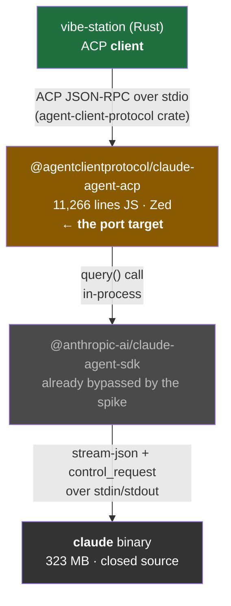
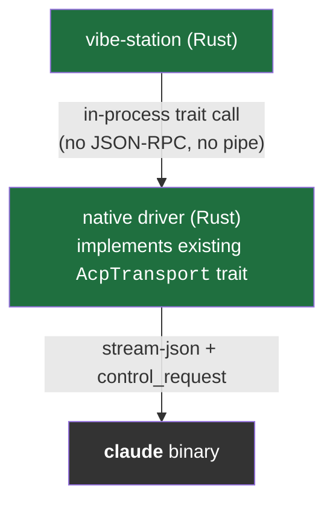
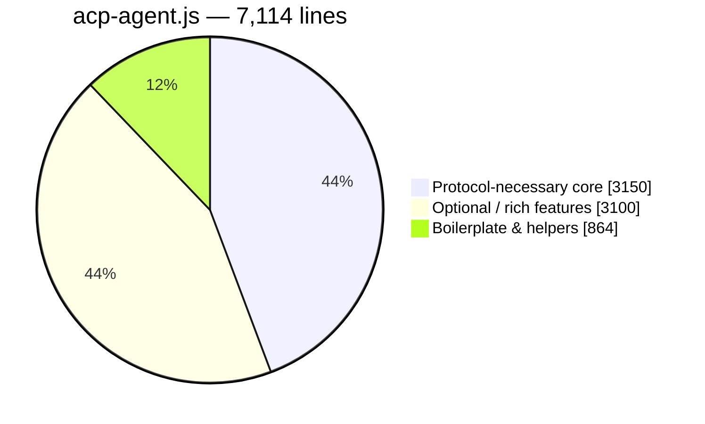
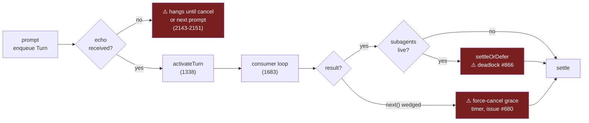
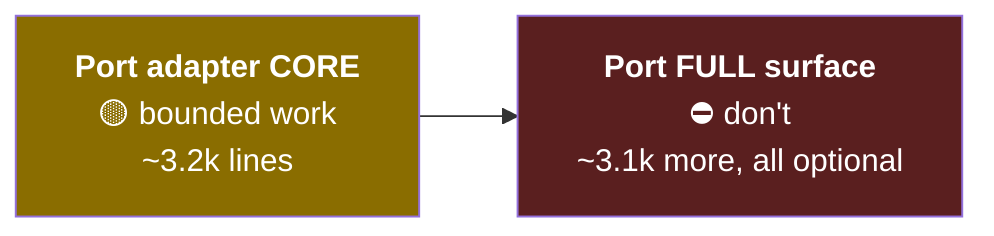

# Feasibility: a native-Rust replacement for `@agentclientprotocol/claude-agent-acp`

**Question:** can a Rust ACP-driving tool (vibe-station, or anything shaped like it) drop
Bun/Node/npm entirely for Claude support?

**Answer in one line:** yes — port ~3.2k lines of the adapter's core (bounded, no technical wall),
skip the rest (unnecessary). Three new behavioral constraints found; none is a blocker.

> **Settled, not evaluated here:** `@anthropic-ai/claude-agent-sdk` is **not** being ported. It is a
> thin wrapper for the spawn+prompt+parse use case, and the existing Rust spike already talks to the
> `claude` binary directly without it. This document takes that as given. What survives from that
> investigation is **§1 — the requirements the SDK's behavior imposes on any direct driver**, which
> are not optional just because the SDK isn't being ported.
>
> 

One-line justification, for the record

>
> `query()` does no settings merging (`sdk.mjs:118:~7300` — it forwards `--setting-sources=`,
> `--managed-settings` and a `--settings` blob and lets the CLI resolve), no retry/respawn/reconnect
> (`sdk.mjs:118:11120` latches the error once), and holds no session state (`class Gg` fields at
> `sdk.mjs:118:19873` are pure protocol plumbing; `hO` at `151:219410` even writes `session_id:""`).
> The bundled MDM/plist/registry policy chain is reachable only through the separately-exported
> `resolveSettings` (`o5`, `151:209894`), which the process transport never calls — all policy
> resolution happens inside the `claude` binary.
> 

---

## Sources read

Everything below is read from real artifacts on this machine — not docs, not memory.

| Artifact | Path |
| --- | --- |
| ACP adapter (compiled JS) | `~/.bun/install/cache/@agentclientprotocol/claude-agent-acp@0.70.0@@@1/dist/` |
| Anthropic SDK (bundled JS) | `~/.bun/install/cache/@anthropic-ai/claude-agent-sdk@0.3.232@@@1/` |
| Rust ACP SDK (crate source) | `~/.cargo/registry/src/index.crates.io-1949cf8c6b5b557f/agent-client-protocol-2.1.0/` |
| Consumer | `~/code/fastestdevalive/vibe-station/rust/vst-agents/` |

> **Citation format.** `sdk.mjs` refs are `file:line:col` — that file is a 1.32 MB esbuild bundle
> whose 155 "lines" are each tens of thousands of chars wide, so `wc -l` is meaningless there.
> Adapter refs are plain `file:line`.

---

## The stack today

### Target after the port

> **Refined by plan D9.** The port ships as a **library** that serves ACP over any transport.
> vibe-station links it and talks to it over an in-memory `Channel::duplex()` — still in-process and
> no pipe, but through ACP rather than `AcpTransport`, because the fork cannot depend on
> vibe-station's trait. A thin stdio binary serves other ACP clients and the differential harness.

Key structural point: vibe-station is an ACP **client** with a frozen in-process abstraction already
(`acp_transport.rs:115-178`). A native driver implements *that trait* — so the agent-side JSON-RPC
surface disappears from the port entirely.

---

## §1 — Requirements the direct-to-`claude` driver must satisfy

These are what the SDK was doing on your behalf. Not porting it means **inheriting these as
requirements**, ordered by how badly each bites if missed.

| # | Requirement | Consequence if missed | Evidence |
| --- | --- | --- | --- |
| 1 | **Send `systemPrompt`, `agents`, `hooks`, `skills`, `toolAliases`, `supportedDialogKinds` in the `initialize` control_request — not as CLI flags** | Control channel is on the critical path from day one, not a later phase for permission prompts | `sdk.mjs:120:~4100` |
| 2 | **Do not close stdin after the prompt** once a `canUseTool`/hook/MCP/elicitation callback is registered | **CLI deadlocks** | `sdk.mjs:118:20530` (`hasBidirectionalNeeds()`) |
| 3 | Use argv `--output-format stream-json --verbose --input-format stream-json`; set `CLAUDE_CODE_ENTRYPOINT` | **`--print` is never passed by the SDK** — the spike's argv differs. Non-interactive mode is inferred from stream-json IO + the entrypoint var | `sdk.mjs:118:4903`; `grep -o -- '"--print"' sdk.mjs` → **0 hits** |
| 4 | Consume `keep_alive` frames silently | Naive parser leaks them to the caller | `sdk.mjs:118:23865` |
| 5 | Honor the `suppressControlResponse` sentinel = *deliberately never answer* | Answering anyway breaks handoff to a more capable client | `sdk.mjs:118:19850` |
| 6 | Replay `pending_permission_requests` / `pending_user_dialog_requests` from the `initialize` response | Dropped permission prompts on resume | `sdk.mjs:120:~8200` |
| 7 | Handle `control_cancel_request` for in-flight cancellation | — | `sdk.mjs:118:~24900` |
| 8 | Drain stderr before treating exit as final; keep a 2 KB stderr tail | "exit code 1" instead of an actionable message | `sdk.mjs:118:704`, `118:786` |
| 9 | Let a `result` with `is_error` **replace** the raw process error | Much worse diagnostics | `sdk.mjs:118:~24200` |
| 10 | SIGTERM→SIGKILL ladder (2 s / 5 s) via a **separate** forwarded abort controller | Wiring the user's signal straight to `spawn` hard-kills instead of closing gracefully | `sdk.mjs:118:~14900`; controller at `118:3400` |
| 11 | Reap children on parent exit | Orphaned `claude` processes | `sdk.mjs:118:806`–`949` |
| 12 | Resolve the binary yourself | SDK does **no PATH lookup** — fixed candidate list over optional native packages, glibc/musl ordering | `b1`, `sdk.mjs:118:17481`; musl detect `118:17296` |

### Control-channel subset to implement

| Scope | Size | Needed? |
| --- | --- | --- |
| `initialize`, `can_use_tool`, `interrupt`, `set_permission_mode`, `hook_callback` | ~a few hundred Rust lines | ✅ Yes — this is the core |
| Full `class Gg` surface (~35 outbound subtypes) | ~22 KB minified ≈ 800–1000 source lines (`sdk.mjs:118:19873`–`124:452`) | ❌ No — most are one-liners for features being skipped |
| **In-process MCP server over the control channel** — `class Ik` (`sdk.mjs:118:19590`) + `connectSdkMcpServer` + `sendMcpServerMessageToCli` + `handleMcpControlRequest` | Bidirectional JSON-RPC id correlation + outbound-id short-circuit | ❌ Not today. **The one piece with real design** — if it's ever needed, port it carefully rather than reinventing |

> **Correction to the prior investigation.** `CLAUDE_CODE_EXECUTABLE` **does not exist in SDK
> 0.3.232** — `grep -c` returns **0** across `sdk.mjs`, `sdk.d.ts`, `bridge.mjs`. vibe-station sets
> it (`vst-agents/src/claude.rs:420`) and it works because **the adapter** reads it
> (`dist/acp-agent.js:233-236`, applied at `4908`). The SDK only honors
> `options.pathToClaudeCodeExecutable`. A native driver owns this resolution outright.

---

## §2 — Is `claude-agent-acp` portable, and how much is needed?

### Verdict: **portable, no technical wall.** The honest number is ~3.2k lines, not 7,100.

### Package inventory (11,266 lines total)

| File | Lines | Keep? |
| --- | --- | --- |
| `acp-agent.js` | 7,114 | Partially — see split below |
| `tools.js` | 1,111 | ~630 of it (tool shape mapping) |
| `file-change-audit.js` | 379 | ❌ JetBrains/AIR extension |
| `session-failure-extension.js` | 351 | ❌ JetBrains/AIR extension |
| `elicitation.js` | 304 | ❌ optional |
| `settings.js` | 185 | ❌ optional (and built on SDK `@alpha` APIs — `settings.js:5,90-91`) |
| `index.js` | 98 | ❌ Node CLI entry |
| `utils.js` | 81 | ❌ Node stream adapters |
| `goal-extension.js` | 50 | ❌ optional |

### `acp-agent.js` split

> Caveat: buckets interleave inside `runConsumer` and `createSession` rather than sitting in clean
> blocks, and a large share of "core" lines are **prose comments** — the turn-lifecycle region
> `1215–1845` is roughly half commentary. Treat 3,150 as an estimate with real error bars.

### (A) Protocol-necessary core — must port

| Concern | Lines in `acp-agent.js` | ~Count |
| --- | --- | --- |
| `initialize` capabilities | `693–746` | 54 |
| `newSession` / `loadSession` + non-optional `createSession` | `747–759`, `788–798`, `4645–4695`, ~200 of `4696–5209` | ~200 |
| `prompt` (enqueues a Turn, owns no loop) | `973–1037` | 65 |
| Turn activate / settle / orphan accounting | `1338–1682` | 345 |
| Consumer loop + abort/EOF race | `1683–1845` | 163 |
| `result` → stop reasons | `2532–2884` | 353 |
| Idle settle via `session_state_changed` | `2049–2163` | 115 |
| Stream → ACP mappers | `6383–6759`, `6760–6864`, `6303–6382` | 562 |
| Prompt content mapping | `6101–6193` | 93 |
| **Permission translation** | `4069–4275`, `4017–4068`, `447–541` | 354 |
| `cancel` | `3443–3668`, `6865–6892` | 254 |
| fs passthrough | `4002–4016` | 15 |
| Wiring | `542–572`, `6893–6929` | ~250 |
| Tool shape mapping | `tools.js:16–357`, `423–717` | ~630 |

### (B) Optional — safe to skip

| Feature | ~Lines | Note |
| --- | --- | --- |
| Config options / modes / fast mode | 630 | `3724–3860`, `4388–4644`, `5479–5675` |
| Model resolution + allowlisting | 560 | `5676–6045`, `6930–7114` |
| Elicitation | 540 | `elicitation.js` + `4276–4374` + refusal-fallback `2396–2481` |
| File-change audit (JetBrains/AIR) | 480 | Negotiated as `_meta` capability at `acp-agent.js:734` |
| Session-failure ext (JetBrains/AIR) | 450 | Same — **AIR pair = ~930 lines, largest single skippable chunk** |
| Auth / gateway / providers | 390 | `595–692`, `850–972`, `5307–5392` |
| TODO / plan lists | 270 | |
| Settings watching | 210 | Requires reimplementing the SDK merge, or skip |
| Subagent transcripts | 200 | |
| Hooks (PostToolUse/TaskCreated/TaskCompleted) | 180 | |
| Terminal support | 140 | |
| Goal extension | 140 | |
| Custom slash commands | 95 | |
| MCP server passthrough | 60 | |

### What the Rust ACP SDK gives you free

`agent-client-protocol` 2.1.0 — **mature**: v2.2.0 released 2026-09-18, 4.5 M total downloads,
authored by Zed, runtime-agnostic (tokio is dev-dependency only), all handler bounds are `Send` →
**no `LocalSet` constraint** (a change from 0.x).

| Provided | Evidence |
| --- | --- |
| Newline-delimited JSON-RPC over stdio | `src/stdio.rs:11-85` |
| Connection loop, `ConnectionTo<…>`, req/resp correlation | `src/jsonrpc.rs` |
| Cancellation plumbing | `Responder::cancellation()`, `src/jsonrpc.rs:4611` |
| Full typed ACP schema | `agent-client-protocol-schema-1.7.0` |
| `SessionUpdate` enum | `schema/src/v1/client.rs:99-159` |
| Agent→client requests (`session/request_permission`, `fs/*`, `terminal/*`, `elicitation/create`) | `src/schema/agent_to_client/requests.rs:10-49` |
| Extensions — `ExtRequest`/`ExtNotification`, `_`-prefixed methods, `[ext]` fallback, `_meta` on ~195 types, `on_receive_dispatch`, derive macros | `schema/v1/ext.rs:25-96` |

**Not provided — zero Claude-specific help:**

- ❌ No stream-json parsing anywhere.
- ❌ Its only Claude reference is `AcpAgent::claude_agent()` (`src/acp_agent.rs:192-197`) — which
  shells out to `npx -y @agentclientprotocol/claude-agent-acp`, i.e. **the exact thing being
  replaced**.

> **Correction to the prior architecture note.** In 2.x, `Agent` is a **zero-sized role marker**
> (`src/role/acp.rs:291`), not a trait to implement. You register typed handlers on
> `Agent::builder()` (`role/acp.rs:335-352`; full 21-line agent at `examples/simple_agent.rs`).
> The 0.4.x `Agent` trait with `initialize`/`prompt`/`cancel` **is gone**.

### The scope-shrinker nobody had written down

vibe-station consumes only **8 of 14** `SessionUpdate` variants (`normalize.rs:340-473`):

| Consumed | Explicitly discarded |
| --- | --- |
| `AgentMessageChunk`, `AgentThoughtChunk`, `UserMessageChunk`, `ToolCall`, `ToolCallUpdate`, `CurrentModeUpdate`, `AvailableCommandsUpdate`, `Plan` | `SessionInfoUpdate`, `ConfigOptionUpdate`, `UsageUpdate` (`normalize.rs:471-473`) |

Combined with implementing `AcpTransport` in-process, this cuts the port well below the 3.2k figure.

### The real cost centre: the turn-settlement state machine

Not the message mapping — **this**. It is reverse-engineered from undocumented CLI behavior and
says so in its own comments.

| Hazard | Self-documented as | Line |
| --- | --- | --- |
| Orphan coalescing ordering | *"asserted from observed CLI behavior, not a documented wire contract — if a dead turn's late result could lag past the NEXT turn's dispatch frames, deleting a zombie and a started entry on one result would double-consume it"* | `1453` |
| Subagent attribution | *"an undocumented SDK invariant (`task_started.task_id` === `canUseTool`'s `agentID`…; verified against the bundled CLI)"* | `4109-4113` |
| Async-generator race | *"async generators serialize `next()` calls, so racing a SECOND `next()` while one is pending would make the abandoned one swallow a message"* | `1687-1692` |
| Wedged `query.next()` | Force-cancel grace timer exists purely for this — issue **#680** | `46`, `1683-1685`, `3595-3605` |
| Pre-echo abandonment | Documented **unfixable** hole: *"still hangs until cancel or the next prompt; only a timer could tell those apart"* | `2143-2151` |
| Latched boolean, accepted wrong case | Issue **#453** | `1595-1606` |
| Streamed tool-input recovery | Incremental JSON-prefix lexer closing a partial object at a top-level comma | `179-232` |
| Interrupt reconciliation | Dual-lane for CLIs with/without `interrupt_receipt_v1`; guards the **field** not the receipt *"so a bare `{}` success from a gateway can't read as 'everything was dropped'"* | `3608-3648` |
| Subagent permission deadlock | Issue **#866** — every settle path must route through `settleOrDefer` | `1553-1560` |
| `getContextUsage` stall | Refuses to call it pre-first-turn: *"~15 s stall, issues #886/#880"* and *"SDK control requests are serialized over one channel"* so it would drag `setModel` down with it | `4416-4420`, `7005-7016` |

**None of this is a wall.** All of it is empirical knowledge that took upstream many releases to
accumulate, and a from-scratch port re-enters that discovery loop **with no test suite to match
against**.

### Can Rust actually express this concurrency?

**Yes — and for most of these hazards Rust is a net improvement, because several are artifacts of
JavaScript's async model rather than intrinsic protocol problems.** But there is one genuinely new
hazard that runs the other way.

| JS hazard | Rust disposition | Why |
| --- | --- | --- |
| Async-generator `next()` race (`1687-1692`) — must hold the in-flight `next()` across abort wake-ups or the abandoned one swallows a message | **Dissolves entirely** | `tokio::sync::mpsc::Receiver::recv` is **cancel-safe**: *"If `recv` is used as a branch in `tokio::select!` and another branch completes first, it is guaranteed that no messages were received on this channel"* (`tokio-1.53.1/src/sync/mpsc/unbounded.rs:124`). The whole `pendingNext` hack is unnecessary. |
| Wedged `query.next()` → force-cancel grace timer (#680) | **Easier** | `tokio::select!` against a `CancellationToken` or `tokio::time::timeout`, rather than a hand-rolled re-armed timer |
| Control requests serialized over one channel (`4416-4420`) | **Easier, and enforceable** | Single writer task owning the pipe + a `oneshot` response map. Rust's ownership makes the single-writer invariant a compile-time fact instead of a convention |
| Orphan accounting, interrupt reconciliation, settle-deferral (#866) | **Same difficulty** | Plain state-machine logic — language-neutral. The hard part is knowing the rules, not expressing them |
| — | ⚠️ **NEW: loss of run-to-completion atomicity** | JS is single-threaded: every synchronous stretch between `await`s is atomic *by construction*. `session.activeTurn`, `pendingOrphanResults`, `emittedToolCalls` are mutated with that guarantee implicitly. On multi-threaded tokio with `Arc<Mutex<…>>`, a line-by-line port can introduce interleavings **that never existed upstream** — and the upstream comments won't warn you, because upstream never had to think about it |

**The mitigation is already the house pattern.** `acp_connection.rs:1-25` documents it: one background
tokio task per connection owns all state, every operation arrives as a `Command` over an `mpsc` with
a bundled `oneshot` reply. That reproduces JS's single-threaded run-to-completion semantics exactly —
no locks, no interleaving — while keeping Rust's guarantees. `acp_run_turn.rs:128-145` already runs
the cancel-safe `select!` shape against `updates.recv()`.

**So the risk is not Rust's capability — it is a design discipline choice made early:**

- ✅ **Actor task owning session state** → semantics match upstream; the hazard table above is mostly wins.
- ⛔ **`Arc<Mutex<Session>>` shared across tasks** → you inherit every upstream race *plus* a new class
  upstream never had. Specifically: holding a lock across `.await`, and putting a **non**-cancel-safe
  future in a `select!` branch (the one real Rust footgun — it silently drops data the same way the
  JS generator did).

---

## §3 — Bottom line

### Scoring

| Component | Verdict | Rough scope | Confidence |
| --- | --- | --- | --- |
| **(a)** Reimplement adapter CORE in Rust | **Real but bounded.** No blocker; ACP framing free; in-process `AcpTransport` removes the agent side. Cost = the undocumented turn-settlement state machine. | ~3.2k JS-equivalent lines; less for vibe-station's 8-of-14 surface | **Medium-high** — line-accounted, but comment-heavy JS makes it soft |
| **(b)** Reimplement FULL feature surface | **Not worth it, and unnecessary.** Every rich feature independently droppable; ~930 lines are vendor-specific (JetBrains/AIR). | ~3.1k more lines, mostly optional | **High** — each feature's ranges are isolable |
| **(c)** Control-channel subset (from §1) | **Small and well-understood.** Five subtypes carry the core. | a few hundred Rust lines | **High** |
| SDK in-process MCP over control channel | **Deferred.** The one piece with real design; not needed today. | dense but self-contained | **High** |
| Rust concurrency capability | **Not a risk — a net win.** Cancel-safe `recv()` dissolves the worst JS hazard outright; the actor pattern is already the house style. Conditional on choosing actor-over-mutex early. | design decision, not line count | **High** — verified against tokio source and existing repo code |
| **Genuinely new blockers** | **None found.** | — | **Medium** — absence of evidence over one read |

### New constraints found (beyond the known "undocumented, therefore fragile" risk)

| # | Constraint | Consequence if ignored |
| --- | --- | --- |
| 1 | Control requests are **serialized over a single channel** (`acp-agent.js:4416-4420`) | A slow request head-of-line-blocks every other one |
| 2 | Do **not** close stdin after the prompt once a permission/hook callback is registered (`sdk.mjs:118:20530`) | CLI deadlocks |
| 3 | `keep_alive`, `control_cancel_request`, and `pending_permission_requests` replay must be handled | Decoder misbehaves in ways that look like Claude bugs |

### Recommendation

- ✅ **Proceed** on the core port (a), carrying §1 as the driver's requirements spec.
- ⛔ **Explicitly descope** the full feature surface (b).
- ⚠️ Treat the **turn-settlement state machine**, not the wire format, as the schedule risk.
- 🔒 **Commit to the actor pattern for session state on day one** (as `acp_connection.rs` already
  does). Not a stylistic preference: it is what preserves upstream's implicit run-to-completion
  atomicity. Choosing `Arc<Mutex<Session>>` instead imports a race class upstream never had.
- 🔬 **Before committing implementer time:** build a differential harness that runs identical prompts
  through the Node path and the Rust path and diffs the resulting `SessionUpdate` streams. That is
  the test suite upstream has and a from-scratch port otherwise does not.
