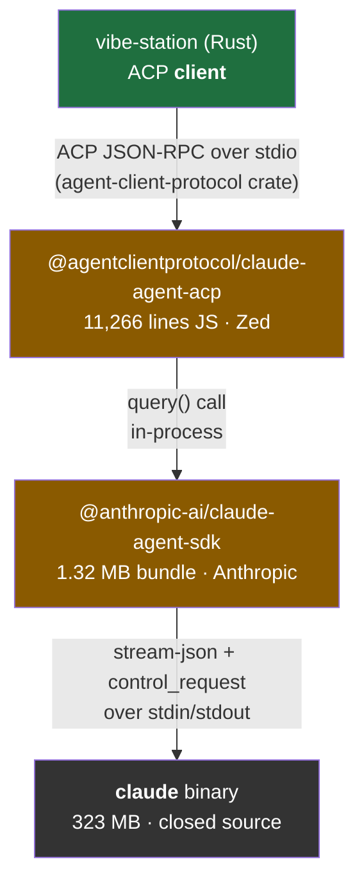
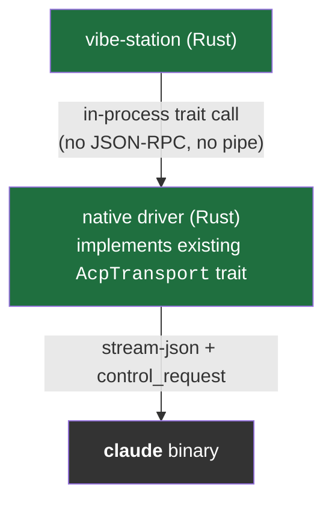
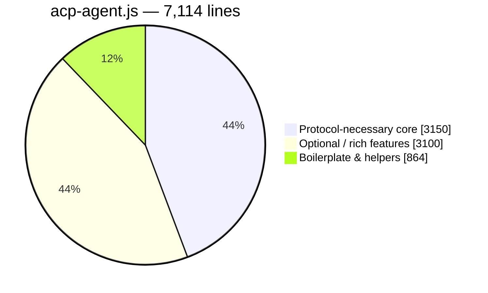
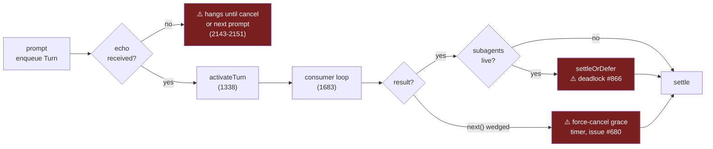

# Feasibility: a native-Rust replacement for `@agentclientprotocol/claude-agent-acp`

**Question:** can a Rust ACP-driving tool (vibe-station, or anything shaped like it) drop
Bun/Node/npm entirely for Claude support — and does `@anthropic-ai/claude-agent-sdk` have to be
ported too?

**Answer in one line:** yes — bypass the SDK (proven), port ~3.2k lines of the adapter's core
(bounded), skip the rest (unnecessary). No technical wall found; three new behavioral constraints
found.

---

## Sources read

Everything below is read from real artifacts on this machine — not docs, not memory.

| Artifact | Path |
| --- | --- |
| ACP adapter (compiled JS) | `~/.bun/install/cache/@agentclientprotocol/claude-agent-acp@0.70.0@@@1/dist/` |
| Anthropic SDK (bundled JS) | `~/.bun/install/cache/@anthropic-ai/claude-agent-sdk@0.3.232@@@1/` |
| Rust ACP SDK (crate source) | `~/.cargo/registry/src/index.crates.io-1949cf8c6b5b557f/agent-client-protocol-2.1.0/` |
| Consumer | `~/code/fastestdevalive/vibe-station/rust/vst-agents/` |

> **Citation format.** `sdk.mjs` refs are `file:line:col` — that file is a 1.32 MB esbuild bundle
> whose 155 "lines" are each tens of thousands of chars wide, so `wc -l` is meaningless there.
> Adapter refs are plain `file:line`.

---

## The stack today

Amber = the two Node/Bun layers to be removed. The `claude` binary stays either way.

### Target after the port

Key structural point: vibe-station is an ACP **client** with a frozen in-process abstraction already
(`acp_transport.rs:115-178`). A native driver implements *that trait* — so the agent-side JSON-RPC
surface disappears from the port entirely.

---

## Q1 — Does `claude-agent-sdk` need porting, or can it be bypassed?

### Verdict: **bypass it.** The spike is already on the right side of the line.

### What `query()` does NOT do (so nothing is lost)

| Suspected responsibility | Reality | Evidence |
| --- | --- | --- |
| Settings merging | **None.** Forwards `--setting-sources=`, `--managed-settings`, `--settings` blob and lets the CLI resolve. | `sdk.mjs:118:~7300`; merge helper `m1` at `118:213` |
| MDM / registry / plist policy | **Bundled but unreachable** from `query()` | Defined `sdk.mjs:151:20500` (paths), `151:57103` (macOS plist), `151:205007` (Win/WSL `reg.exe`), `151:197963` (6-tier merge) — all reachable only via exported `resolveSettings` (`o5`, `151:209894`), which the transport never calls |
| Retry / respawn / reconnect | **None.** Spawn error latched once, iterator throws. | `sdk.mjs:118:11120`; only backoff in file (`[200,800]`) is the transcript batcher, gated on `sessionStore` |
| Session state / history / compaction | **None.** Stateless pass-through. | `class Gg` fields at `sdk.mjs:118:19873` are pure protocol plumbing |
| Session id tracking | **None** — writes `session_id:""` | `hO`, `sdk.mjs:151:219410` |
| PATH lookup for `claude` | **None.** Fixed candidate list over optional native packages. | `b1`, `sdk.mjs:118:17481`; musl detect `118:17296` |

### What a hand-rolled spawn+parse WOULD miss

These are the load-bearing bits. Ordered by how badly they bite.

| # | Finding | Why it matters | Evidence |
| --- | --- | --- | --- |
| 1 | **System prompt, agents, hooks, skills, `toolAliases`, `supportedDialogKinds` are sent in the `initialize` control_request — not as CLI flags** | Control channel is on the critical path immediately, not "later, for permissions" | `sdk.mjs:120:~4100` |
| 2 | **`hasBidirectionalNeeds()` suppresses close-stdin-after-prompt** whenever a `canUseTool`/hook/MCP/elicitation callback is registered | Close stdin early with a permission callback live → **CLI deadlocks** | `sdk.mjs:118:20530` |
| 3 | Real argv is `--output-format stream-json --verbose --input-format stream-json` — **`--print` is never passed** | The spike's argv differs from the SDK's. Non-interactive mode inferred from stream-json IO + `CLAUDE_CODE_ENTRYPOINT="sdk-ts"` | `sdk.mjs:118:4903`; `grep -o -- '"--print"' sdk.mjs` → **0 hits** |
| 4 | `keep_alive` frames consumed silently | Naive parser leaks them to the caller | `sdk.mjs:118:23865` |
| 5 | `suppressControlResponse` sentinel = *deliberately never answer* | Answering anyway breaks the handoff to a more capable client | `sdk.mjs:118:19850` |
| 6 | `pending_permission_requests` / `pending_user_dialog_requests` replay on the `initialize` response | Dropped permission prompts on resume | `sdk.mjs:120:~8200` |
| 7 | `control_cancel_request` for in-flight cancellation | — | `sdk.mjs:118:~24900` |
| 8 | stderr drain-before-exit race + 2 KB stderr tail | Turns "exit code 1" into an actionable message | `sdk.mjs:118:704`, `118:786` |
| 9 | A `result` with `is_error` **replaces** the raw process error | Much better diagnostics | `sdk.mjs:118:~24200` |
| 10 | SIGTERM→SIGKILL ladder (2 s / 5 s) via a **separate** forwarded abort controller | Wiring the user's signal straight to `spawn` hard-kills instead | `sdk.mjs:118:~14900`, controller at `118:3400` |
| 11 | Module-global `process.on("exit")` child reaper | Orphaned `claude` processes | `sdk.mjs:118:806`–`949` |

### Correction to the prior investigation

> **`CLAUDE_CODE_EXECUTABLE` does not exist in SDK 0.3.232.**
> `grep -c` returns **0** across `sdk.mjs`, `sdk.d.ts`, `bridge.mjs`.

- vibe-station sets it at `vst-agents/src/claude.rs:420`.
- It works because **the adapter** reads it — `dist/acp-agent.js:233-236`, applied at `4908`.
- The SDK only honors `options.pathToClaudeCodeExecutable`.

### Size of the piece worth respecting

| Component | Size | Port it? |
| --- | --- | --- |
| `query()` itself | 3 statements (`sdk.mjs:152:477`) | Trivially |
| Process transport `class Rk` | ~15 KB minified (`sdk.mjs:118:3022`) | argv + Node stream bookkeeping — reimplement |
| **Control protocol `class Gg`** | **~22 KB minified ≈ 800–1000 source lines** (`sdk.mjs:118:19873`–`124:452`) | Subset only: `initialize`, `can_use_tool`, `interrupt`, `set_permission_mode`, `hook_callback` ≈ a few hundred Rust lines |
| **In-process MCP over control channel** | `class Ik` (`sdk.mjs:118:19590`) + `connectSdkMcpServer` + `sendMcpServerMessageToCli` + `handleMcpControlRequest` | **The only piece with real design.** Bidirectional JSON-RPC id correlation + outbound-id short-circuit. **vibe-station does not use it today.** |

---

## Q2 — Is `claude-agent-acp` portable, and how much is needed?

### Verdict: **portable, no technical wall.** But the honest number is ~3.2k lines, not 7,100.

### Package inventory (11,266 lines total)

| File | Lines | Keep? |
| --- | --- | --- |
| `acp-agent.js` | 7,114 | Partially — see split below |
| `tools.js` | 1,111 | ~630 of it (tool shape mapping) |
| `file-change-audit.js` | 379 | ❌ JetBrains/AIR extension |
| `session-failure-extension.js` | 351 | ❌ JetBrains/AIR extension |
| `elicitation.js` | 304 | ❌ optional |
| `settings.js` | 185 | ❌ optional (and built on SDK `@alpha` APIs — `settings.js:5,90-91`) |
| `index.js` | 98 | ❌ Node CLI entry |
| `utils.js` | 81 | ❌ Node stream adapters |
| `goal-extension.js` | 50 | ❌ optional |

### `acp-agent.js` split

> Caveat: buckets interleave inside `runConsumer` and `createSession` rather than sitting in clean
> blocks, and a large share of "core" lines are **prose comments** — the turn-lifecycle region
> `1215–1845` is roughly half commentary.

### (A) Protocol-necessary core — must port

| Concern | Lines in `acp-agent.js` | ~Count |
| --- | --- | --- |
| `initialize` capabilities | `693–746` | 54 |
| `newSession` / `loadSession` + non-optional `createSession` | `747–759`, `788–798`, `4645–4695`, ~200 of `4696–5209` | ~200 |
| `prompt` (enqueues a Turn, owns no loop) | `973–1037` | 65 |
| Turn activate / settle / orphan accounting | `1338–1682` | 345 |
| Consumer loop + abort/EOF race | `1683–1845` | 163 |
| `result` → stop reasons | `2532–2884` | 353 |
| Idle settle via `session_state_changed` | `2049–2163` | 115 |
| Stream → ACP mappers | `6383–6759`, `6760–6864`, `6303–6382` | 562 |
| Prompt content mapping | `6101–6193` | 93 |
| **Permission translation** | `4069–4275`, `4017–4068`, `447–541` | 354 |
| `cancel` | `3443–3668`, `6865–6892` | 254 |
| fs passthrough | `4002–4016` | 15 |
| Wiring | `542–572`, `6893–6929` | ~250 |
| Tool shape mapping | `tools.js:16–357`, `423–717` | ~630 |

### (B) Optional — safe to skip

| Feature | ~Lines | Note |
| --- | --- | --- |
| Config options / modes / fast mode | 630 | `3724–3860`, `4388–4644`, `5479–5675` |
| Model resolution + allowlisting | 560 | `5676–6045`, `6930–7114` |
| Elicitation | 540 | `elicitation.js` + `4276–4374` + refusal-fallback `2396–2481` |
| File-change audit (JetBrains/AIR) | 480 | Negotiated as `_meta` capability at `acp-agent.js:734` |
| Session-failure ext (JetBrains/AIR) | 450 | Same — **AIR pair = ~930 lines, largest single skippable chunk** |
| Auth / gateway / providers | 390 | `595–692`, `850–972`, `5307–5392` |
| TODO / plan lists | 270 | |
| Settings watching | 210 | Requires reimplementing the SDK merge, or skip |
| Subagent transcripts | 200 | |
| Hooks (PostToolUse/TaskCreated/TaskCompleted) | 180 | |
| Terminal support | 140 | |
| Goal extension | 140 | |
| Custom slash commands | 95 | |
| MCP server passthrough | 60 | |

### What the Rust ACP SDK gives you free

`agent-client-protocol` 2.1.0 — **mature**: v2.2.0 released 2026-09-18, 4.5 M total downloads,
authored by Zed, runtime-agnostic (tokio is dev-dependency only), all handler bounds are `Send` →
**no `LocalSet` constraint** (a change from 0.x).

| Provided | Evidence |
| --- | --- |
| Newline-delimited JSON-RPC over stdio | `src/stdio.rs:11-85` |
| Connection loop, `ConnectionTo<…>`, req/resp correlation | `src/jsonrpc.rs` |
| Cancellation plumbing | `Responder::cancellation()`, `src/jsonrpc.rs:4611` |
| Full typed ACP schema | `agent-client-protocol-schema-1.7.0` |
| `SessionUpdate` enum | `schema/src/v1/client.rs:99-159` |
| Agent→client requests (`session/request_permission`, `fs/*`, `terminal/*`, `elicitation/create`) | `src/schema/agent_to_client/requests.rs:10-49` |
| Extensions — `ExtRequest`/`ExtNotification`, `_`-prefixed methods, `[ext]` fallback, `_meta` on ~195 types, `on_receive_dispatch`, derive macros | `schema/v1/ext.rs:25-96` |

**Not provided — zero Claude-specific help:**

- ❌ No stream-json parsing anywhere.
- ❌ Its only Claude reference is `AcpAgent::claude_agent()` (`src/acp_agent.rs:192-197`) — which
  shells out to `npx -y @agentclientprotocol/claude-agent-acp`, i.e. **the exact thing being
  replaced**.

> **Correction to the prior architecture note.** In 2.x, `Agent` is a **zero-sized role marker**
> (`src/role/acp.rs:291`), not a trait to implement. You register typed handlers on
> `Agent::builder()` (`role/acp.rs:335-352`; full 21-line agent at `examples/simple_agent.rs`).
> The 0.4.x `Agent` trait with `initialize`/`prompt`/`cancel` **is gone**.

### The scope-shrinker nobody had written down

vibe-station consumes only **8 of 14** `SessionUpdate` variants (`normalize.rs:340-473`):

| Consumed | Explicitly discarded |
| --- | --- |
| `AgentMessageChunk`, `AgentThoughtChunk`, `UserMessageChunk`, `ToolCall`, `ToolCallUpdate`, `CurrentModeUpdate`, `AvailableCommandsUpdate`, `Plan` | `SessionInfoUpdate`, `ConfigOptionUpdate`, `UsageUpdate` (`normalize.rs:471-473`) |

Combined with implementing `AcpTransport` in-process, this cuts the port well below the 3.2k figure.

### The real cost centre: the turn-settlement state machine

Not the message mapping — **this**. It is reverse-engineered from undocumented CLI behavior and
says so in its own comments.

| Hazard | Self-documented as | Line |
| --- | --- | --- |
| Orphan coalescing ordering | *"asserted from observed CLI behavior, not a documented wire contract — if a dead turn's late result could lag past the NEXT turn's dispatch frames, deleting a zombie and a started entry on one result would double-consume it"* | `1453` |
| Subagent attribution | *"an undocumented SDK invariant (`task_started.task_id` === `canUseTool`'s `agentID`…; verified against the bundled CLI)"* | `4109-4113` |
| Async-generator race | *"async generators serialize `next()` calls, so racing a SECOND `next()` while one is pending would make the abandoned one swallow a message"* | `1687-1692` |
| Wedged `query.next()` | Force-cancel grace timer exists purely for this — issue **#680** | `46`, `1683-1685`, `3595-3605` |
| Pre-echo abandonment | Documented **unfixable** hole: *"still hangs until cancel or the next prompt; only a timer could tell those apart"* | `2143-2151` |
| Latched boolean, accepted wrong case | Issue **#453** | `1595-1606` |
| Streamed tool-input recovery | Incremental JSON-prefix lexer closing a partial object at a top-level comma | `179-232` |
| Interrupt reconciliation | Dual-lane for CLIs with/without `interrupt_receipt_v1`; guards the **field** not the receipt *"so a bare `{}` success from a gateway can't read as 'everything was dropped'"* | `3608-3648` |
| Subagent permission deadlock | Issue **#866** — every settle path must route through `settleOrDefer` | `1553-1560` |
| `getContextUsage` stall | Refuses to call it pre-first-turn: *"~15 s stall, issues #886/#880"* and *"SDK control requests are serialized over one channel"* so it would drag `setModel` down with it | `4416-4420`, `7005-7016` |

**None of this is a wall.** All of it is empirical knowledge that took upstream many releases to
accumulate, and a from-scratch port re-enters that discovery loop **with no test suite to match
against**.

---

## Q3 — Bottom line

The three components sit in three different risk categories. Conflating them is what makes this look
like a yes/no question.

### Scoring

| Component | Verdict | Rough scope | Confidence |
| --- | --- | --- | --- |
| **(a)** Bypass `claude-agent-sdk` entirely | **Low-risk / already proven.** Spike did it; genuinely thin for spawn+prompt+parse. | ~0 (done) + a few hundred lines for the control-channel subset | **High** — read the real bundle; `resolveSettings` verified unreachable from `query()` |
| **(b)** Reimplement adapter CORE in Rust | **Real but bounded.** No blocker; ACP framing free; in-process `AcpTransport` removes the agent side. Cost = the undocumented turn-settlement state machine. | ~3.2k JS-equivalent lines; less for vibe-station's 8-of-14 surface | **Medium-high** — line-accounted, but comment-heavy JS makes it soft |
| **(c)** Reimplement FULL feature surface | **Not worth it, and unnecessary.** Every rich feature independently droppable; ~930 lines are vendor-specific (JetBrains/AIR). | ~3.1k more lines, mostly optional | **High** — each feature's ranges are isolable |
| SDK in-process MCP over control channel | **The one piece with real design.** Port carefully *if* needed; not needed today. | ~22 KB minified `class Gg`, MCP multiplexing is the dense part | **High** |
| **Genuinely new blockers** | **None found.** | — | **Medium** — absence of evidence over one read |

### New constraints found (beyond the known "undocumented, therefore fragile" risk)

| # | Constraint | Consequence if ignored |
| --- | --- | --- |
| 1 | Control requests are **serialized over a single channel** (`acp-agent.js:4416-4420`) | A slow request head-of-line-blocks every other one |
| 2 | Do **not** close stdin after the prompt once a permission/hook callback is registered (`sdk.mjs:118:20530`) | CLI deadlocks |
| 3 | `keep_alive`, `control_cancel_request`, and `pending_permission_requests` replay must be handled | Decoder misbehaves in ways that look like Claude bugs |

### Recommendation

- ✅ **Proceed** on (a) and (b).
- ⛔ **Explicitly descope** (c).
- ⚠️ Treat the **turn-settlement state machine**, not the wire format, as the schedule risk.
- 🔬 **Before committing implementer time:** build a differential harness that runs identical prompts
  through the Node path and the Rust path and diffs the resulting `SessionUpdate` streams. That is
  the test suite upstream has and a from-scratch port otherwise does not.
